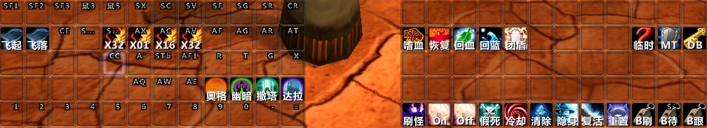
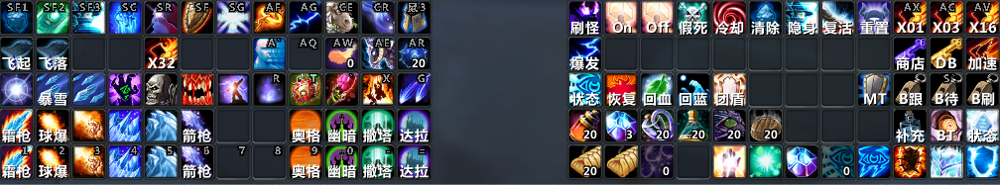
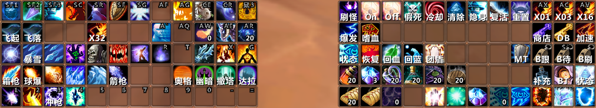
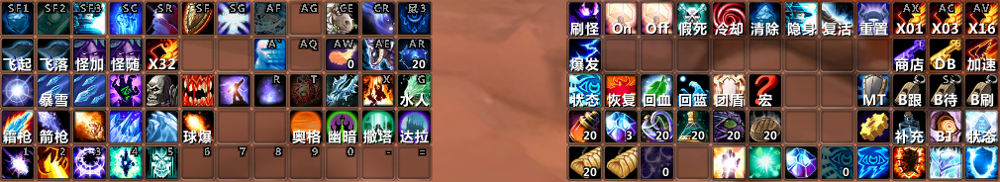

.. _KeyBinding:

键位设置(Keybinding)
===============================================================================



法师(Mage)
-------------------------------------------------------------------------------
奥术(Arcane)



火焰(Fire)



冰霜(Frost)




常用自定义快捷键设置方针
~~~~~~~~~~~~~~~~~~~~~~~~~~~~~~~~~~~~~~~~~~~~~~~~~~~~~~~~~~~~~~~~~~~~~~~~~~~~~~~
我使用 **Domino动作条扩展** 插件对动作条进行设置, 游戏一共有10个自带动作条,

对于某些职业, 随着姿态的切换, 默认的动作条(动作条1)会自动发生切换。例如:

对于战士:

- 动作条7: 战斗姿态(战士)
- 动作条8: 防御姿态(战士)
- 动作条9: 狂暴姿态(战士)

对于德鲁伊:

- 动作条7: 猎豹形态(德鲁伊)
- 动作条8: 树人形态(德鲁伊)
- 动作条9: 巨熊形态(德鲁伊) 
- 动作条10: 枭兽形态(德鲁伊)

全局生效宏命令, 动作条6: 由于动作条7, 8, 9, 10在某些时候会被各种姿态下的默认技能占用, 所以我们将全局生效宏命令放在动作条6

**快捷键设置概览**

- ````` 潜行(盗贼, 德鲁伊), 暗影形态(牧师), 插图腾(萨满)
- ``Shift + Q`` 战斗姿态(战士), 巨熊形态(德鲁伊), 鲜血领域(死亡骑士), 防御光环(圣骑士)
- ``Shift + W`` 防御姿态(战士), 猎豹形态(德鲁伊), 邪恶领域(死亡骑士), 专注光环(圣骑士)
- ``Shift + E`` 狂暴姿态(战士), 枭兽/树人形态(德鲁伊), 冰霜领域(死亡骑士), 十字军光环(圣骑士)

- ``Shift + ``` Fox32, 机器人停留待命
- ``Alt + ``` 
- ``Alt + Q``
- ``Alt + W``
- ``Alt + E`` 控制类技能2: 纠缠根须(德鲁伊), 放逐术(术士)

左边第1个动作条, 动作条5:

- ``Shift + F1`` 减伤, 保命技能1
- ``Shift + F2`` 减伤, 保命技能2
- ``Shift + F3`` 减伤, 保命技能3

- ``鼠标中键`` Combo技能中的第一个技能, 例如: ``急速冷却 + 霜冻新星`` 中的 ``急速冷却``。
- ``鼠标按键5(侧面上部按键)`` 坐骑

- ``Shift + X`` 可使用类饰品(除PvP徽章外的), 例如爆发类饰品, 或救命类饰品等。
- ``Shift + C``
- ``Shift + Z``

- ``Shift + F``
- ``Shift + G``
- ``Shift + R``
- ``Ctrl + R`` (注, Shift + T由于距离过远, 不便于按键, 所以舍弃了)

左边第2个动作条, 动作条4:

- ``Ctrl + E`` 控制类技能1: 妖术(萨满), 飓风术(德鲁伊), 变形术(法师), 恐惧术(术士)
- ``Shift + 鼠标中键``
- ``Shift + 鼠标按键5(侧面上部按键)``

- ``Alt + X`` X1速度宏
- ``Alt + C`` X16速度宏
- ``Alt + Z`` X32速度宏

- ``Alt + F``
- ``Alt + G``
- ``Alt + R``
- ``Alt + T``

左边第3个动作条, 动作条3:

- ``Shift + Tab`` 丢魔杖(法师系), 远程射击或投掷(物理系), 旅行形态(德鲁伊)
- ``Alt + F1`` 种族天赋技能
- ``R`` 打断类技能, 盾击/拳击(战士), 制裁之锤(圣骑士), 震击(萨满), 脚踢(盗贼), 法术反制(法师), 术士(恐惧),牧师(沉默) 
- ``T`` 徽章
- ``G``
- ``X`` 断筋(战士), 摔绊(猎人), 冰霜震击(萨满), 烈焰风暴(法师), 疲劳诅咒(术士)
