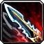
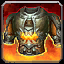

.. _学习武器和防具技能的GM命令:

学习武器和防具技能的GM命令 (Learn Weapon and Armor Skill GM Command)
===============================================================================

.. contents:: 目录
    :depth: 1
    :local:

在巫妖王之怒及其之前的版本中, 玩家并不是一出生就自动能使用所有类型的武器的. 例如 ``战士`` 即使能使用 ``双手剑``, 但也只能在 ``主城`` 找 ``武器大师`` 学习技能之后才能使用.

而对于锁甲和板甲职业 (战士, 圣骑士, 猎人, 萨满), 达到40级之后可以找职业训练师学习更高一级的护甲技能, 才能穿上更高级种类的护甲 (例如猎人40级之后才可以穿锁甲, 战士40级之后才可以穿板甲).

虽然允许玩家使用武器和防具的技能属于 Skill (技能) 类, **并不属于** Spell (法术) 类. 但是在跟 ``武器大师`` 或 ``职业训练师`` 对话时, 是通过 NPC 对玩家施放 ``.learn <spell_id>``, 让玩家 **学习一个隐藏的被动法术, 而这个法术的效果是让玩家获得某个 Skill**. 所以, GM 可以使用 ``.learn`` 命令让玩家学会武器和防具技能.

让玩家所有武器和防具技能全满的 GM 命令::

    .max

.. _学习武器技能GM命令:

学习 **武器技能** GM命令
-------------------------------------------------------------------------------

.. list-table:: 使玩家学会使用各种武器技能的GM命令 (来自武器大师)
    :class: sortable
    :header-rows: 1
    :stub-columns: 0

    * - 名称
      - GM 命令
    * - 徒手攻击
      - .. code-block:: python

            .learn 203
    * - 单手剑
      - .. code-block:: python

            .learn 201
    * - 双手剑
      - .. code-block:: python

            .learn 202
    * - 单手锤
      - .. code-block:: python

            .learn 198
    * - 双手锤
      - .. code-block:: python

            .learn 199
    * - 单手斧
      - .. code-block:: python

            .learn 196
    * - 双手斧
      - .. code-block:: python

            .learn 197
    * - 匕首
      - .. code-block:: python

            .learn 1180
    * - 长柄武器
      - .. code-block:: python

            .learn 200
    * - 拳套武器
      - .. code-block:: python

            .learn 15590
    * - 双武器
      - .. code-block:: python

            .learn 674
    * - 双武器
      - .. code-block:: python

            .learn 42459
    * - 法杖
      - .. code-block:: python

            .learn 227
    * - 魔杖
      - .. code-block:: python

            .learn 5009
    * - 弓
      - .. code-block:: python

            .learn 264
    * - 弩
      - .. code-block:: python

            .learn 7919
    * - 枪械
      - .. code-block:: python

            .learn 266
    * - 投掷
      - .. code-block:: python

            .learn 2567

.. note::

    不能用某些武器的职业也能够通过学习该武器技能穿上该武器, 例如让法师学会双手剑, 只是在技能面板不予显示.

.. _学习防具技能GM命令:

学习 **防具技能** GM命令
-------------------------------------------------------------------------------

.. list-table:: 使玩家学会使用各种防具技能的GM命令
    :class: sortable
    :header-rows: 1
    :stub-columns: 0

    * - name
      - learn_cmd
    * - 布甲
      - .. code-block:: python

            .learn 9078
    * - 皮甲
      - .. code-block:: python

            .learn 9077
    * - 锁甲
      - .. code-block:: python

            .learn 8737
    * - 板甲
      - .. code-block:: python

            .learn 750
    * - 盾牌
      - .. code-block:: python

            .learn 9116

.. note::

    不能穿某些护甲的职业也能够通过学习该护甲技能从而能穿上该护甲, 例如牧师穿板甲, 只是在技能面板不予显示.

各职业能学习的所有武器技能
------------------------------------------------------------------------------

.. contents:: 目录
    :depth: 1
    :local:

战士
~~~~~~~~~~~~~~~~~~~~~~~~~~~~~~~~~~~~~~~~~~~~~~~~~~~~~~~~~~~~~~~~~~~~~~~~~~~~~~
常用武器::

    .learn 201 单手剑
    .learn 202 双手剑
    .learn 198 单手锤
    .learn 199 双手锤
    .learn 196 单手斧
    .learn 197 双手斧
    .learn 1180 匕首

其他::

    .learn 200 长柄武器
    .learn 15590 拳套武器
    .learn 674 双武器
    .learn 227 法杖
    .learn 264 弓
    .learn 7919 弩
    .learn 266 枪械
    .learn 2567 投掷
    .learn 750 板甲
    .learn 9116 盾牌

圣骑士
~~~~~~~~~~~~~~~~~~~~~~~~~~~~~~~~~~~~~~~~~~~~~~~~~~~~~~~~~~~~~~~~~~~~~~~~~~~~~~
::

    .learn 201 单手剑
    .learn 202 双手剑
    .learn 198 单手锤
    .learn 199 双手锤
    .learn 196 单手斧
    .learn 197 双手斧
    .learn 750 板甲
    .learn 9116 盾牌

死亡骑士
~~~~~~~~~~~~~~~~~~~~~~~~~~~~~~~~~~~~~~~~~~~~~~~~~~~~~~~~~~~~~~~~~~~~~~~~~~~~~~
::

    .learn 201 单手剑
    .learn 202 双手剑
    .learn 198 单手锤
    .learn 199 双手锤
    .learn 196 单手斧
    .learn 197 双手斧
    .learn 200 长柄武器
    .learn 674 双武器

猎人
~~~~~~~~~~~~~~~~~~~~~~~~~~~~~~~~~~~~~~~~~~~~~~~~~~~~~~~~~~~~~~~~~~~~~~~~~~~~~~
::

    .learn 201 单手剑
    .learn 202 双手剑
    .learn 198 单手锤
    .learn 199 双手锤
    .learn 196 单手斧
    .learn 197 双手斧
    .learn 200 长柄武器
    .learn 227 法杖
    .learn 674 双武器
    .learn 8737 锁甲

萨满
~~~~~~~~~~~~~~~~~~~~~~~~~~~~~~~~~~~~~~~~~~~~~~~~~~~~~~~~~~~~~~~~~~~~~~~~~~~~~~
::

    .learn 198 单手锤
    .learn 196 单手斧
    .learn 1180 匕首
    .learn 15590 拳套武器
    .learn 227 法杖
    .learn 8737 锁甲
    .learn 9116 盾牌

盗贼
~~~~~~~~~~~~~~~~~~~~~~~~~~~~~~~~~~~~~~~~~~~~~~~~~~~~~~~~~~~~~~~~~~~~~~~~~~~~~~
::

    .learn 201 单手剑
    .learn 198 单手锤
    .learn 196 单手斧
    .learn 1180 匕首
    .learn 15590 拳套武器
    .learn 674 双武器
    .learn 264 弓
    .learn 7919 弩
    .learn 266 枪械
    .learn 2567 投掷

法师
~~~~~~~~~~~~~~~~~~~~~~~~~~~~~~~~~~~~~~~~~~~~~~~~~~~~~~~~~~~~~~~~~~~~~~~~~~~~~~
::

    .learn 201 单手剑
    .learn 1180 匕首
    .learn 227 法杖

术士
~~~~~~~~~~~~~~~~~~~~~~~~~~~~~~~~~~~~~~~~~~~~~~~~~~~~~~~~~~~~~~~~~~~~~~~~~~~~~~
::

    .learn 201 单手剑
    .learn 1180 匕首
    .learn 227 法杖

牧师
~~~~~~~~~~~~~~~~~~~~~~~~~~~~~~~~~~~~~~~~~~~~~~~~~~~~~~~~~~~~~~~~~~~~~~~~~~~~~~
::

    .learn 198 单手锤
    .learn 1180 匕首
    .learn 227 法杖
