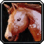

.. _坐骑相关GM命令:

坐骑相关GM命令 (Mount GM Command)
===============================================================================

有关坐骑的物品和法术的说明
------------------------------------------------------------------------------
在魔兽世界一共有5个骑术的等级:

- 20 级可学, 60 % 移动速度的陆地坐骑
- 40 级可学, 100 % 移动速度的陆地坐骑
- 60 级可学, 150 % 移动速度的飞行坐骑
- 60 级可学, 150 % 移动速度的飞行坐骑
- 68 级可学, 寒冷气候飞行, 允许你在诺森德骑乘飞行坐骑

在魔兽世界中坐骑是用 Spell (法术) 来实现的. 当玩家拿到一个坐骑物品后, 右键点击后, 会学到一个召唤该坐骑的法术, 该法术的效果是使玩家获得一个光环类的效果. 所以使用 GM 命令骑上某个坐骑一共有三种方法:

1. 找到坐骑物品的 item_id, 用 ``.add item <item_id>`` 添加该物品.
2. 找到坐骑物品对应的法术 spell_id, 用 ``.learn <spell_id>`` 学会召唤法术.
3. 找到坐骑效果的光环的 spell_id, 用 ``.aura <spell_id>`` 直接上马, 用 ``.unaura <spell_id>`` 下马.

下表中没有的坐骑请在 ``ItemDB`` 插件中的 ``杂项 (Miscellaneous) / 坐骑 (Mounts)`` 的分类中查询。或者在AtlasLoots插件面板中的 ``套装/特殊物品`` -> ``坐骑`` 中查看。查看到了想要的坐骑后用 ``.add <item_id>`` 将其添加背包, 使用后习得。或者尝试召唤该坐骑, 然后用 ``SpellID`` 插件查询该坐骑光环的 ``spell_id``, 然后直接使用 ``.aura <spell_id>`` 直接骑上坐骑.

.. _学会所有骑术的GM命令:

学会所有骑术的 GM 命令
------------------------------------------------------------------------------
.. list-table::
    :widths: 10 60

    * - 添加物品命令
      - 说明
    * - ::

            /target player
            .learn 33388
            .learn 33391
            .learn 34090
            .learn 34091
            .learn 54197
            /targetlasttarget
      - ::

            /target player
            .learn 33388 60 % 速度陆地坐骑
            .learn 33391 100 % 速度陆地坐骑
            .learn 34090 150 % 速度飞行坐骑
            .learn 34091 280 % 速度飞行坐骑
            .learn 54197 寒冷气候飞行
            /targetlasttarget

.. _如何找到你想要的坐骑的GM命令:

如何找到你想要的坐骑的GM命令
------------------------------------------------------------------------------
例如, 你记得你很喜欢 ``凤凰坐骑`` 但不知道物品代码和光环代码, 除了查阅 :ref:`下表 <巫妖王之怒全坐骑GM命令速查>`, 还可以: 打开 AtlasLooter 插件 -> 套装 / 收藏 -> 坐骑 -> 稀有, 你就能在里面找到凤凰的物品代码然后用 ``.add item xxxxx`` 命令添加了. 如果你的鼠标放在坐骑图标上但不显示 id, 那么你要再选项里找到 "始终显示物品 ID" 选项并勾选即可.

.. _巫妖王之怒所有坐骑入手方法攻略:

巫妖王之怒所有坐骑入手方法攻略
------------------------------------------------------------------------------
可以参考网上的这篇资料:

- 魔兽世界坐骑大全 1/4: http://blog.sina.com.cn/s/blog_537a33890100jwwc.html
- 魔兽世界坐骑大全 2/4: http://blog.sina.com.cn/s/blog_537a33890100jwzb.html
- 魔兽世界坐骑大全 3/4: http://blog.sina.com.cn/s/blog_537a33890100jwzt.html
- 魔兽世界坐骑大全 4/4: http://blog.sina.com.cn/s/blog_537a33890100jx06.html

.. _巫妖王之怒热门坐骑GM命令速查:

巫妖王之怒热门坐骑GM命令速查
------------------------------------------------------------------------------

.. jinja:: doc_data

    {{ doc_data.lt_popular_mount().render() }}

.. _巫妖王之怒全坐骑GM命令速查:

巫妖王之怒全坐骑GM命令速查 (95%全)
------------------------------------------------------------------------------

.. jinja:: doc_data

    {{ doc_data.lt_all_mount().render() }}
