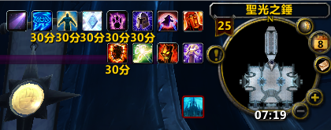

.. _RaidBuff:

模拟团队 Buff 和 Debuff
===============================================================================

.. image:: RaidDeBuff.png

在单机版模式下, 由于只有一个人, 无法体验在官服打团队副本时, 有队友刷齐 Buff, 给怪物上 Debuff 的过程. 本文档将各职业所需的 WLK 团队副本 Buff 和 Debuff 做成了宏, 方便一键刷齐所有 Buff. 这里的宏命令有两个版本, 一个版本适用于允许各种光环类 Buff 允许叠加的服务端. 例如同一个 Buff 如果你用 ``.aura`` 命令加很多次就会叠加, 所以在 ``.aura`` 命令之前 ``.unaura``, 这些是比较老的端. 一个版本适用于不允许各种光环叠加的服务端.

一键上 Buff 和 Debuff 宏命令
-------------------------------------------------------------------------------
你是下列的某种职业，若要一键获得所有团队副本中所能获得的Buff，请往下看。

.. _RaidBuff_PhysicDPS:

物理DPS Buff (武器/狂暴战士, 战斗/刺杀/敏锐盗贼, 猫德, 猎人, 增强萨满)
~~~~~~~~~~~~~~~~~~~~~~~~~~~~~~~~~~~~~~~~~~~~~~~~~~~~~~~~~~~~~~~~~~~~~~~~~~~~~~~
.. list-table::
    :widths: 10 60
    :header-rows: 1

    * - 宏命令
      - 说明
    * - ::

            /target player
            .aura 48161
            .aura 48469
            .aura 47436
            .aura 56525
            .aura 48942
            .aura 24932
            .unaura 34300
            .aura 34300
            .aura 19506
            .aura 75447
            .unaura 58646
            .aura 58646
            .aura 55610
            .aura 57399
            .aura 53760
            /targetlasttarget

      - ::

            /target player
            .aura 48161 真言术:韧
            .aura 48469 野性祝福
            .aura 47436 战斗怒吼
            .aura 56525 王者祝福
            .aura 48942 虔诚光环
            .aura 24932 兽群领袖
            .unaura 34300
            .aura 34300 强化兽群领袖
            .aura 19506 强击光环
            .aura 75447 凶猛灵感
            .unaura 58646
            .aura 58646 大地之力图腾
            .aura 55610 强化寒冰爪
            .aura 57399 鲜鱼宴
            .aura 53760 无尽怒火合剂
            /targetlasttarget

.. _RaidDebuff_PhysicDPS:

物理DPS有利Debuff (武器/狂暴战士, 战斗/刺杀/敏锐盗贼, 猫德, 猎人)
~~~~~~~~~~~~~~~~~~~~~~~~~~~~~~~~~~~~~~~~~~~~~~~~~~~~~~~~~~~~~~~~~~~~~~~~~~~~~~~
请根据需要自行修改技能名称:

.. list-table::
    :widths: 10 60
    :header-rows: 1

    * - 宏命令
      - 说明
    * - ::

            #showtooltip
            /cast [mod:alt]嗜血术; 旋风斩
            /stopmacro [noharm]
            .aura 54499
            .aura 71554
            .aura 71554
            .aura 71554
            .aura 71554
            .aura 71554
            .aura 16857
            .aura 58683
            .aura 33983
            .aura 20185
            ##.aura 20186

      - ::

            #showtooltip
            /cast [mod:alt]嗜血术; 旋风斩
            /stopmacro [noharm]
            .aura 54499 十字军之心
            .aura 71554 破甲
            .aura 71554
            .aura 71554
            .aura 71554
            .aura 71554
            .aura 16857 精灵之火
            .aura 58683 残忍战斗
            .aura 33983 裂伤
            .aura 20185 光明审判 战士 盗贼 野德
            ##.aura 20186 智慧审判 猎人萨满

.. _RaidBuff_SpellDPS:

法系DPS Buff (法师, 术士, 暗影牧师, 元素萨满, 平衡德鲁伊)
~~~~~~~~~~~~~~~~~~~~~~~~~~~~~~~~~~~~~~~~~~~~~~~~~~~~~~~~~~~~~~~~~~~~~~~~~~~~~~~
.. list-table::
    :widths: 10 60
    :header-rows: 1

    * - 宏命令
      - 说明
    * - ::

            /target player
            .aura 56525
            .aura 48161
            .aura 42995
            .aura 48073
            .aura 48469
            .aura 24907
            .aura 75447
            .aura 54646
            .aura 19746
            .unaura 58777
            .aura 58777
            .unaura 57663
            .aura 57663
            .unaura 2895
            .aura 2895
            .aura 57399
            .aura 53755
            /targetlasttarget

      - ::

            /target player
            .aura 56525 王者祝福
            .aura 48161 真言术:韧
            .aura 42995 奥术智慧
            .aura 48073 神圣精神
            .aura 48469 野性祝福
            .aura 24907 枭兽光环
            .aura 75447 凶猛灵感
            .aura 54646 专注魔法
            .aura 19746 专注光环
            .unaura 58777
            .aura 58777 法力之泉图腾
            .unaura 57663
            .aura 57663 天怒图腾
            .unaura 2895
            .aura 2895 空气图腾
            .aura 57399 鲜鱼宴
            .aura 53755 冰霜巨龙合剂
            /targetlasttarget

.. _RaidDebuff_SpellDPS:

法系 DPS 有利 Debuff (法师, 术士, 暗影牧师, 元素萨满, 平衡德鲁伊)
~~~~~~~~~~~~~~~~~~~~~~~~~~~~~~~~~~~~~~~~~~~~~~~~~~~~~~~~~~~~~~~~~~~~~~~~~~~~~~~
请根据需要自行修改技能名称:

.. list-table::
    :widths: 10 60
    :header-rows: 1

    * - 宏命令
      - 说明
    * - ::

            #showtooltip
            /cast [mod:alt]冰枪术; 寒冰箭
            /stopmacro [noharm]
            .aura 54499
            .aura 47865
            .aura 22959
            .aura 33198
            .aura 31589

      - ::

            #showtooltip
            /cast [mod:alt]冰枪术; 寒冰箭
            /stopmacro [noharm]
            .aura 54499 十字军之心
            .aura 47865 元素诅咒
            .aura 22959 强化灼烧
            .aura 33198 悲惨
            .aura 31589 减速术

.. _RaidBuff_Tank:

Tank Buff (防御战士, 防御圣骑士, 防御死亡骑士, 熊坦德鲁伊)
~~~~~~~~~~~~~~~~~~~~~~~~~~~~~~~~~~~~~~~~~~~~~~~~~~~~~~~~~~~~~~~~~~~~~~~~~~~~~~~
.. list-table::
    :widths: 10 60
    :header-rows: 1

    * - 宏命令
      - 说明
    * - ::

            /target player
            .aura 48161
            .aura 48469
            .aura 47440
            .aura 25899
            .aura 48942
            .aura 24932
            .unaura 34300
            .aura 34300
            .aura 19506
            .aura 75447
            .unaura 58646
            .aura 58646
            .aura 55610
            .aura 57399
            .aura 53758
            /targetlasttarget

      - ::

            /target player
            .aura 48161 真言术:韧
            .aura 48469 野性祝福
            .aura 47440 命令怒吼
            .aura 25899 庇护祝福
            .aura 48942 虔诚光环
            .aura 24932 兽群领袖
            .unaura 34300
            .aura 34300 强化兽群领袖
            .aura 19506 强击光环
            .aura 75447 凶猛灵感
            .unaura 58646
            .aura 58646 大地之力图腾
            .aura 55610 强化寒冰爪
            .aura 57399 鲜鱼宴
            .aura 53758 石血合剂
            /targetlasttarget

.. _RaidDebuff_Tank:

Tank有利Debuff (防御战士, 防御圣骑士, 防御死亡骑士, 熊坦德鲁伊)
~~~~~~~~~~~~~~~~~~~~~~~~~~~~~~~~~~~~~~~~~~~~~~~~~~~~~~~~~~~~~~~~~~~~~~~~~~~~~~~
请根据需要自行修改技能名称:

.. list-table::
    :widths: 10 60
    :header-rows: 1

    * - 宏命令
      - 说明
    * - ::

            #showtooltip
            /cast 破甲
            /stopmacro [noharm]
            .aura 47437
            .aura 31589
            .aura 47502

      - ::

            #showtooltip
            /cast 破甲
            /stopmacro [noharm]
            .aura 47437 挫志咆哮
            .aura 31589 减速术
            .aura 47502 雷霆一击

.. _RaidBuff_Healer:

治疗 Buff (戒律/神圣牧师, 神圣圣骑士, 恢复萨满, 恢复德鲁伊)
~~~~~~~~~~~~~~~~~~~~~~~~~~~~~~~~~~~~~~~~~~~~~~~~~~~~~~~~~~~~~~~~~~~~~~~~~~~~~~~
.. list-table::
    :widths: 10 60
    :header-rows: 1

    * - 宏命令
      - 说明
    * - ::

            /target player
            .aura 56525
            .aura 48161
            .aura 42995
            .aura 48073
            .aura 48469
            .aura 24907
            .aura 75447
            .aura 54646
            .aura 19746
            .unaura 58777
            .aura 58777
            .unaura 57663
            .aura 57663
            .unaura 2895
            .aura 2895
            .aura 57399
            .aura 54212
            /targetlasttarget

      - ::

            /target player
            .aura 56525 王者祝福
            .aura 48161 真言术:韧
            .aura 42995 奥术智慧
            .aura 48073 神圣精神
            .aura 48469 野性祝福
            .aura 24907 枭兽光环
            .aura 75447 凶猛灵感
            .aura 54646 专注魔法
            .aura 19746 专注光环
            .unaura 58777
            .aura 58777 法力之泉图腾
            .unaura 57663
            .aura 57663 天怒图腾
            .unaura 2895
            .aura 2895 空气图腾
            .aura 57399 鲜鱼宴
            .aura 54212 精炼智慧合剂
            /targetlasttarget

.. _RaidBuff_Everything:

全部 Buff (魔武双修类职业, 惩戒骑, 增强萨)
~~~~~~~~~~~~~~~~~~~~~~~~~~~~~~~~~~~~~~~~~~~~~~~~~~~~~~~~~~~~~~~~~~~~~~~~~~~~~~~
.. list-table::
    :widths: 10 60
    :header-rows: 1

    * - 宏命令
      - 说明
    * - ::

            /target player
            .aura 48161
            .aura 42995
            .aura 48469
            .aura 47436
            .aura 56525
            .aura 48942
            .aura 24932
            .unaura 34300
            .aura 34300
            .aura 75447
            .unaura 58646
            .aura 58646
            .unaura 57663
            .aura 57663
            .unaura 2895
            .aura 2895
            .aura 24907
            .aura 55610
            /targetlasttarget

      - ::

            /target player
            .aura 48161 真言术:韧
            .aura 42995 奥术智慧
            .aura 48469 野性祝福
            .aura 47436 战斗怒吼
            .aura 56525 王者祝福
            .aura 48942 虔诚光环
            .aura 24932 兽群领袖
            .unaura 34300
            .aura 34300 强化兽群领袖
            .aura 75447 凶猛灵感
            .unaura 58646
            .aura 58646 大地之力图腾
            .unaura 57663
            .aura 57663 天怒图腾
            .unaura 2895
            .aura 2895 空气图腾
            .aura 24907 枭兽光环
            .aura 55610 强化寒冰爪
            /targetlasttarget

.. _RaidDebuff_Everything:

全部 Debuff (魔武双修类职业, 惩戒骑, 增强萨)
~~~~~~~~~~~~~~~~~~~~~~~~~~~~~~~~~~~~~~~~~~~~~~~~~~~~~~~~~~~~~~~~~~~~~~~~~~~~~~~
请根据需要自行修改技能名称

.. list-table::
    :widths: 10 60
    :header-rows: 1

    * - 宏命令
      - 说明
    * - ::

            #showtooltip
            /cast 破甲
            /stopmacro [noharm]
            .aura 47437
            .aura 31589
            .aura 47502

      - ::

            #showtooltip
            /cast [mod:alt]闪电链; 熔岩打击
            /stopmacro [noharm]
            .aura 47437 挫志咆哮
            .aura 31589 减速术
            .aura 47502 雷霆一击
            .aura 47865 元素诅咒
            .aura 22959 强化灼烧
            .aura 33198 苦难
            .aura 54499 十字军之心
            .aura 71554 破甲
            .aura 71554
            .aura 71554
            .aura 71554
            .aura 71554
            .aura 16857 精灵之火
            .aura 58683 狠毒战斗
            .aura 33983 裂伤
            .aura 20185 光明审判

团队副本Buff一览
-------------------------------------------------------------------------------

属性
~~~~~~~~~~~~~~~~~~~~~~~~~~~~~~~~~~~~~~~~~~~~~~~~~~~~~~~~~~~~~~~~~~~~~~~~~~~~~~~
包括: 王者祝福, 真言术: 韧, 奥术智慧, 神圣之灵, 野性印记

60级::

    /target player
    .aura 56525
    .aura 10938
    .aura 10157
    .aura 27841
    .aura 9885
    /targetlasttaget

70级::

    /target player
    .aura 56525
    .aura 25389
    .aura 27126
    .aura 25312
    .aura 26990
    /targetlasttaget

80级::

    /target player
    .aura 56525
    .aura 48161
    .aura 42995
    .aura 48073
    .aura 48469
    /targetlasttaget

攻击强度
~~~~~~~~~~~~~~~~~~~~~~~~~~~~~~~~~~~~~~~~~~~~~~~~~~~~~~~~~~~~~~~~~~~~~~~~~~~~~~~
::

    .aura 47436 战斗怒吼 +550AP 持续2分钟
    .aura 48934 力量祝福 +550AP 持续30分钟
    .aura 19506 强击光环 +10%AP

力量敏捷
~~~~~~~~~~~~~~~~~~~~~~~~~~~~~~~~~~~~~~~~~~~~~~~~~~~~~~~~~~~~~~~~~~~~~~~~~~~~~~~
::

    .aura 57623 凛冬号角 (死亡骑士技能) 力量敏捷+155点 持续2分钟

    # 注: 该技能的aura可以叠加, 使用时要用unaura trick
    .aura 58646 大地之力图腾 (萨满技能) 力量敏捷+155点 永久

全属性
~~~~~~~~~~~~~~~~~~~~~~~~~~~~~~~~~~~~~~~~~~~~~~~~~~~~~~~~~~~~~~~~~~~~~~~~~~~~~~~
::

    .aura 48469 野性赐福 750护甲, 54全抗, 37全属性
    .aura 56525 王者祝福 10%全属性

物理暴击
~~~~~~~~~~~~~~~~~~~~~~~~~~~~~~~~~~~~~~~~~~~~~~~~~~~~~~~~~~~~~~~~~~~~~~~~~~~~~~~
::

    .aura 24932 兽群领袖光环 (德鲁伊技能) +5%物理暴击

    # 该技能配合兽群领袖光环使用, 面板上隐藏, 但有效果
    # 注: 该技能的aura可以叠加, 使用时要用unaura trick
    .aura 34300 强化兽群领袖 暴击加血, 并给自己恢复法力

近战急速
~~~~~~~~~~~~~~~~~~~~~~~~~~~~~~~~~~~~~~~~~~~~~~~~~~~~~~~~~~~~~~~~~~~~~~~~~~~~~~~
::

    .aura 55610 强化冰爪 (冰DK天赋) 100码内全团+20%近战急速, 本人额外+5%近战急速, 光环效果

    # 注: 该技能的aura可以叠加, 使用时要用unaura trick
    .aura 8515 风怒图腾 (萨满技能) +16%近战急速, 光环效果

法术伤害
~~~~~~~~~~~~~~~~~~~~~~~~~~~~~~~~~~~~~~~~~~~~~~~~~~~~~~~~~~~~~~~~~~~~~~~~~~~~~~~
::

    # 注: 该技能的aura可以叠加, 使用时要用unaura trick
    .aura 57663 愤怒图腾 (萨满技能) +280法伤 光环效果

法术暴击
~~~~~~~~~~~~~~~~~~~~~~~~~~~~~~~~~~~~~~~~~~~~~~~~~~~~~~~~~~~~~~~~~~~~~~~~~~~~~~~
::

    .aura 24907 枭兽光环 (平衡德天赋) +5%法暴 永久持续
    .aura xxxxx 元素之誓 (元素萨天赋) +5%法爆 永久持续

法术急速
~~~~~~~~~~~~~~~~~~~~~~~~~~~~~~~~~~~~~~~~~~~~~~~~~~~~~~~~~~~~~~~~~~~~~~~~~~~~~~~
::

    # 注: 该技能的aura可以叠加, 使用时要用unaura trick
    .aura 2895 风惩图腾 (萨满技能) 5%急速 可叠加 永久持续

免伤
~~~~~~~~~~~~~~~~~~~~~~~~~~~~~~~~~~~~~~~~~~~~~~~~~~~~~~~~~~~~~~~~~~~~~~~~~~~~~~~
::

    .aura 25899 庇护祝福 (圣骑士技能) +10%耐 3%免伤

全伤害
~~~~~~~~~~~~~~~~~~~~~~~~~~~~~~~~~~~~~~~~~~~~~~~~~~~~~~~~~~~~~~~~~~~~~~~~~~~~~~~
::

    .aura 75447 凶性鼓舞 (兽王猎人天赋) +3%总伤害

施法专注
~~~~~~~~~~~~~~~~~~~~~~~~~~~~~~~~~~~~~~~~~~~~~~~~~~~~~~~~~~~~~~~~~~~~~~~~~~~~~~~
::

    .aura 19746 专注光环 -35% 施法时因受到攻击而损失的施法时间 [骑士光环]

血量上限
~~~~~~~~~~~~~~~~~~~~~~~~~~~~~~~~~~~~~~~~~~~~~~~~~~~~~~~~~~~~~~~~~~~~~~~~~~~~~~~
::

    .aura 48161 真言术: 韧 +165耐力 持续30分钟
    .aura 47982 血之契约 +1330HP上限 永久持续
    .aura 47440 命令怒吼 +2255hp上限 持续2分钟
    .aura 25899 庇护祝福 +10%耐 3%免伤 持续30分钟

提高护甲
~~~~~~~~~~~~~~~~~~~~~~~~~~~~~~~~~~~~~~~~~~~~~~~~~~~~~~~~~~~~~~~~~~~~~~~~~~~~~~~
::

    .aura 48942 虔诚光环 +1205护甲

抗性类
~~~~~~~~~~~~~~~~~~~~~~~~~~~~~~~~~~~~~~~~~~~~~~~~~~~~~~~~~~~~~~~~~~~~~~~~~~~~~~~
::

    .aura 49071 野性守护 +130 自然抗 [猎人光环]
    .aura 48947 火炕光环 +130 火焰抗 [骑士光环]
    .aura 48945 冰抗光环 +130 冰霜抗 [骑士光环]
    .aura 48943 暗抗光环 +130 暗影抗 [骑士光环]
    .aura 48170 暗影防护 +130 暗影抗 [牧师buff] 不可以跟骑士光环叠加 但不占圣骑士的光环位置

法力回复
~~~~~~~~~~~~~~~~~~~~~~~~~~~~~~~~~~~~~~~~~~~~~~~~~~~~~~~~~~~~~~~~~~~~~~~~~~~~~~~
::

    .aura 48938 强效智慧祝福 (圣骑士技能) 每5秒恢复92点法力, 持续30分钟

    # 注: 该技能的aura可以叠加, 使用时要用unaura trick
    .aura 58777 法力之泉图腾 (撒吗技能) 每5秒恢复92点法力, 持续30分钟

团队副本Debuff一览
-------------------------------------------------------------------------------
以下的Debuff都需要对怪物释放, 使得对团队产生有利效果。

近战DPS有利
~~~~~~~~~~~~~~~~~~~~~~~~~~~~~~~~~~~~~~~~~~~~~~~~~~~~~~~~~~~~~~~~~~~~~~~~~~~~~~~
::

    .aura 54499 十字军之心 +3%被暴击几率 持续20秒
    .aura 71554 破甲 每次-4%甲 持续30秒 可叠加5次 需要X5
    .aura 16857 精灵之火 -5%护甲 持续5分钟
    .aura 58683 狠毒战斗 被毒药影响, 使得受到物理伤害+4%
    .aura 33983 裂伤 +30%流血伤害
    .aura 20185 光明审判 (对战士, 盗贼, 猫德, 死亡骑士有效)
    .aura 20186 智慧审判 (对圣骑士, 萨满, 猎人有效)

法系DPS有利
~~~~~~~~~~~~~~~~~~~~~~~~~~~~~~~~~~~~~~~~~~~~~~~~~~~~~~~~~~~~~~~~~~~~~~~~~~~~~~~
::

    .aura 54499 十字军之心 +3%被暴击几率 持续20秒
    .aura 47865 元素诅咒 -165全抗, +13%伤害, 持续5分钟
    .aura 22959 强化灼烧 +5%暴, 持续30秒, 无法和极寒冰冻叠加
    .aura 33198 苦难 +3%被命中几率 持续24秒
    .aura 31589 减速术 -60%移动, 远程攻击速度, +30%施法时间, 持续15秒

Tank有利
~~~~~~~~~~~~~~~~~~~~~~~~~~~~~~~~~~~~~~~~~~~~~~~~~~~~~~~~~~~~~~~~~~~~~~~~~~~~~~~
::

    .aura 47437 挫志怒吼 -410攻击强度
    .aura 31589 减速术 -60%移动, 远程攻击速度, +30%施法时间, 持续15秒
    .aura 47502 雷霆一击 攻击间隔+10%
    .aura 27648 雷霆之怒 攻击间隔+20% 逐风者之剑特效
