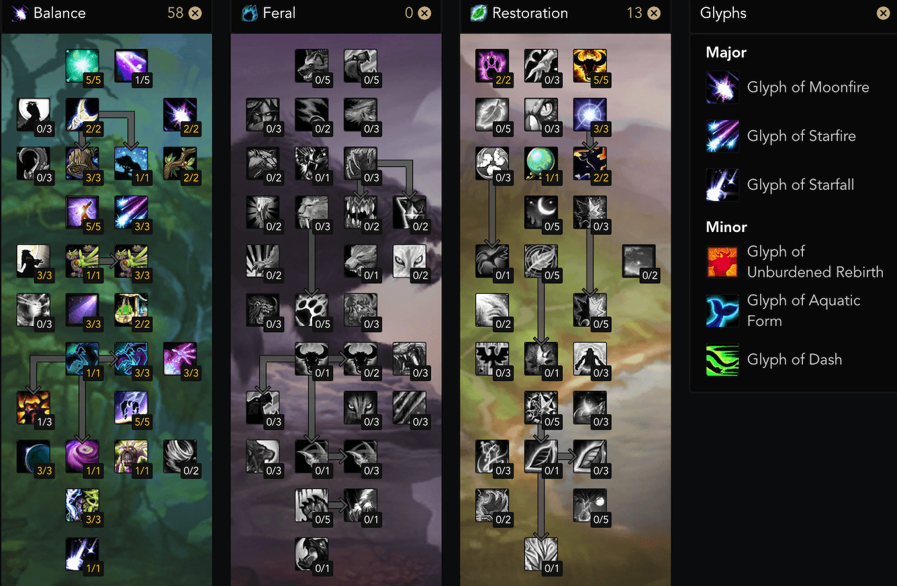

.. _build-icc-resto-druid:

ICC 鸟德
==============================================================================

01. Introduction 简介
------------------------------------------------------------------------------
在 ICC 中, 鸟德的定位是团队 Buff 辅助 + 稳定的远程输出. 鸟德能为团队提供:

- 枭兽形态全团 5% 法系暴击
- 精灵之火 3% 法系命中
- 3 分钟一次激活

优势:

- 由于枭兽形态暴击回蓝的天赋, 鸟德能做到全程几乎满蓝
- 强大, 短 CD, 可控的爆发星落术
- 强大的 AOE, 清小怪毛伤害极为夸张, 可惜几乎没有 AOE 的 boss 战

劣势:

- 对于多个血线危险的队友同时掉血的情况无能为力.

02. Skill 技能
------------------------------------------------------------------------------
起手月火, 虫群, 然后打愤怒, 出月蚀后打星火, 星火期间断 Dot 了不补, 继续打星火. 月蚀完了之后补虫群, 继续打星火直到触发日蚀. 日蚀阶段快要结束的时候如果星火 Dot 快没了, 则卡 GCD 补一个. 综合起来就是, 把握住珍贵的月蚀阶段打星落, Dot 没了也不要浪费时间补. 月蚀阶段到来前提前补好月火.

多目标战斗时补双 Dot.

03. Stat 属性
------------------------------------------------------------------------------
鸟德在月蚀状态下加上各种杂七杂八的天赋以及神像, 星火术有额外 54.8% 的暴击率. 圣骑士的十字军审判天赋还能使得怪物受到的法术暴击几率提高 3%, 术士的强化暗影箭天赋能使得怪物受到的法术暴击几率提高 5%. 也就是说你在枭兽形态下, 如果面板暴击几率达到了 100 - 54.8 - 3 - 5 = 37.2%, 就能在月蚀状态下星火术 100% 造成暴击. 37.2% 也就是俗称的暴击软上限. 但是月蚀的触发条件本身是愤怒暴击, 所以 37.2% 以上的暴击也是有必要的, 但没有必要刻意去堆.

鸟德的愤怒法术施法时间本来就比较短, 而且鸟德有暴击后急速+20% 的天赋, 在团队 Buff 下 585 急速就能使愤怒的施法时间缩短为 1 秒, 达到了 GCD 上限. 这个 585 也就是俗称的急速软上限. 但是由于鸟德的伤害输出主要占比的是星火术, 在 15 秒内能打出多少个星火也能影响你的输出, 但没有必要刻意去堆.

可是在 277 装等的装备下, 你几乎是必然达到暴击和急速的软上限, 不过你没有必要刻意去堆, 主要堆法伤即可.

1. 急速, 暴击 达到软上限. 达到上限后 暴击 > 急速.
2. 尽量堆法伤.
3. 智力: 没有必要刻意堆.
4. 精神, MP5: 枭兽形态下的暴击回蓝在装备很好的情况下能保证你几乎全程满蓝. 请尽量避免该属性.

04. Gear 装备
------------------------------------------------------------------------------
**4T10 / 2T10**

- 头: T10
- 肩: T10
- 胸: T10
- 护腕: 晶红圣所掉落的掉落的暴击急速布甲护腕 (因为是红孔) > 皮甲护腕
- 手套: T10
- 腰带: 玛洛嘉领主掉落的暴击急速腰带
- 裤子: 烂肠掉落的急速命中裤子
- 鞋子: 烂肠掉落的暴击急速靴子
- 项链: 鲜血女王掉落的暴击急速项链
- 戒指: ICC 声望 DPS 戒指
- 戒指: 炮艇战掉落的暴击急速戒指
- 披风: 晶红圣所掉落的暴击急速披风 > 绿龙掉落的暴击急速披风
- 饰品: 晶红圣所掉落的法系 DPS 饰品
- 饰品: 冰龙掉落的法系 DPS 饰品
- 武器: 巫妖王掉落的暴击急速单手锤
- 副手: 鲜血议会掉落的暴击急速副手
- 神像: 冰霜纹章换的神像

05. Gem 宝石
------------------------------------------------------------------------------
- 蓝: 一颗 10 全属性出多彩, 如果只有一个蓝孔, 无视奖励插法伤, 其他情况 法伤精神
- 红: 法伤
- 黄: 法伤暴击/急速 (达到软上限之前), 达到软上限后 法伤暴击
- 多彩: 25 暴击 + 3% 暴击伤害

06. Talent Glyph 天赋 雕文
------------------------------------------------------------------------------

鸟德的雕文几乎没有其他选项.

雕文:

- 月火术: 降低初始伤害, 提高持续伤害
- 星火术: 星火术延长月火术 Dot 的持续时间
- 星落术: 使星落术的 CD 减少 30 秒, 变为 1 分钟一次, 神技, 完爆 专注 雕文 (提高星落伤害, 降低范围)

07. Macro 宏
------------------------------------------------------------------------------

08. ICC 副本攻略
------------------------------------------------------------------------------
1. 玛洛嘉领主

非旋风阶段给坦克挂 Hot 刷滋养. 对中骨刺的人刷 回春 + 愈合. 旋风阶段刷全团回春.

2. 亡语女士

没什么主意的.

3. 炮艇战

没什么主意的.

4. 死亡死者萨鲁法尔

给中印记的角色上回春愈合辅助治疗. 不过这个战斗经常是 DPS Rush, 有奶骑 + 奶萨 就够了, 戒律牧 奶德 甚至都不需要.

5. 烂肠

没什么主意的.

6. 腐面

没什么主意的.

7. 普崔希德教授

给被控制的憎恶上回春, 帮助它回复能量. 其他时候全团回春. 给中红绿软点名的人上 Hot 并刷血. 全场战斗都有 AOE, 该战斗适合奶德发挥.

8. 血亲王议会

帮助给坦克刷血.

9. 鲜血女王

由于全团 AOE 一直存在且伤害较高, 全团回春+野性生长就可以奶出非常夸张的治疗量.

10. 踏梦者瓦莉瑟瑞娅

没什么主意的.

11. 辛达苟萨

全团回春+野性生长, 奶骑奶萨被狂咒点名后辅助奶坦克.

12. 巫妖王

1 阶段帮忙给坦克刷血. 3 阶段和 5 阶段保持主坦克身上的回春, 在灵魂收割 5w 伤害打出的瞬间迅捷治愈抬血. 5 阶段内场全团回春+野性生长.
