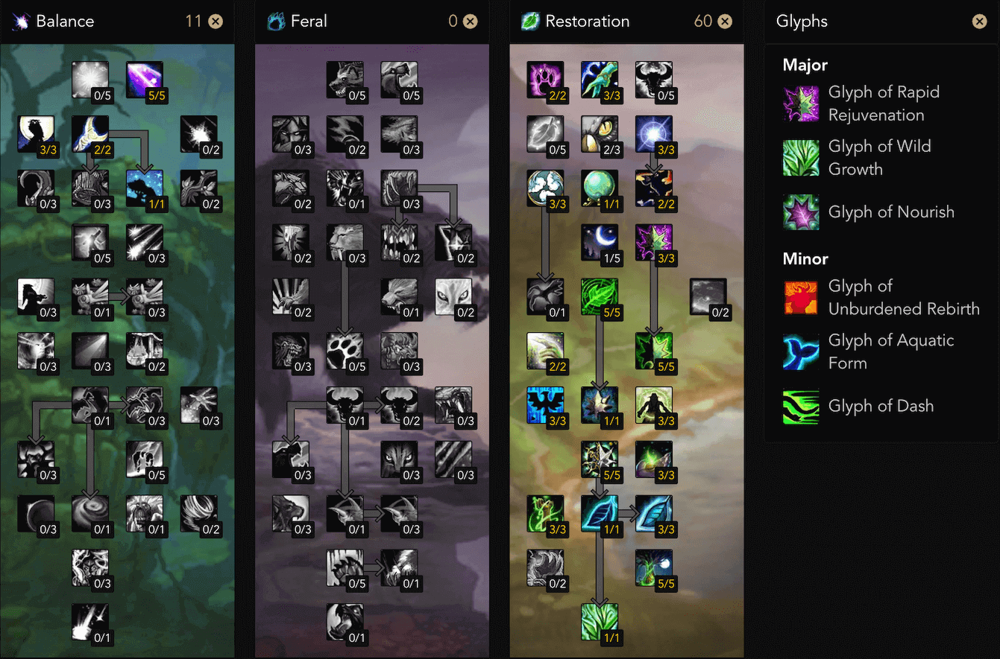

.. _build-icc-resto-druid:

ICC 奶德
==============================================================================

01. Introduction 简介
------------------------------------------------------------------------------
在 ICC 中, 奶德的定位是稳定血线的补充治疗, 擅长平衡能造成全团伤害的技能和机制. 玛洛嘉领主, 烂肠, 教授, 鲜血女王, 冰龙, 巫妖王 都有全团中等幅度稳定掉血的技能. 也被称作是毯子治疗. 对于血线危险的队友, 15 秒一次瞬发的迅捷治愈和施法时间极短的滋养都适合短时间抬起一个人的血线.

优势:

- 所有治疗职业中最高的施法回蓝, 可以全程回春 10 分钟不空蓝.
- 15 秒一次的瞬发迅捷治愈适合应对爆发型伤害.

劣势:

- 对于多个血线危险的队友同时掉血的情况无能为力.

02. Skill 技能
------------------------------------------------------------------------------
平时基本是 5 回春, 1 野性成长. 看到谁血线危急就 迅捷治愈 和 滋养. 哪怕没人掉血, 在蓝量充足的情况下也可以不停的刷回春.

03. Stat 属性
------------------------------------------------------------------------------
**4T10 / 2T10**

该配装下奶德的蓝量和回蓝已经很高了, 没有必要刻意堆精神, 还是以急速达到软上限后堆法伤为主.

1. 急速: 在团队 Buff 下, 没有 Celestial Focus 天赋 (3% 急速) 时需要 856 急速, 有该天赋时需要 735 急速达到回春术 1 秒 GCD 软上限.
2. 法伤: 达到急速软上限后的第一属性, 加大奶量
3. 精神: 由于有增加 15% 精神的天赋, 以及生命之树形态下 15% 的精神转化为法伤, 所以精神对奶德很不错.
3. 暴击: 在额外增加 25% 滋养, 愈合 暴击的天赋下, 不刻意堆暴击你的滋养暴击也能达到 40%+, 并且回春不能暴击, 所以没有必要刻意堆暴击.
5. MP5: 尽量避免该属性. 除非是 ICC 声望戒指这种触发特效实在太好

**4T9**

该配装下在急速达到软上限后堆暴击为主, 回蓝主要靠 大十字军试炼 2 号掉落的抚慰饰品回蓝.

04. Gear 装备
------------------------------------------------------------------------------
**4T10 / 2T10**

- 头: T10
- 肩: T10
- 胸: 议会掉落的布甲急速精神衣服
- 护腕: 绿龙掉落的暴击精神皮甲护腕
- 手套: T10
- 腰带: 教授掉落的暴击急速皮甲腰带
- 裤子: T10
- 鞋子: 炮艇战掉落的暴击精神皮甲靴子
- 项链: 玛洛嘉领主掉落的急速精神项链
- 戒指: ICC 声望戒指
- 戒指: 冰龙掉落的急速精神戒指
- 披风: 萨鲁法尔掉落的急速精神披风
- 饰品: 晶红圣所掉落的奶片
- 饰品: 炮艇战掉落的算盘饰品
- 武器: 橙锤 > 巫妖王掉落的法杖 > 鲜血女王掉落的法杖
- 副手: 橙锤配合冰龙掉落的急速精神副手
- 圣物: 冰霜纹章换的圣物

05. Gem 宝石
------------------------------------------------------------------------------
- 蓝: 一颗 10 全属性出多彩, 其他 法伤精神
- 红: 法伤
- 黄: 法伤急速 (达到软上限之前), 法伤智力
- 多彩: 25 智力, 施法时有机会恢复法力

06. Talent Glyph 天赋 雕文
------------------------------------------------------------------------------

雕文:

- 急速回春: 急速现在影响回春的速度. 在 ICC 后期, 掉血的速度很快, 回春跳得快才能快速的奶起来, 不然被别人奶起来了你的回春很多都是过量. 装备有 6k + gs 后用这个. 和 ``强化回春`` 二选一
- 强化回春: 对生命低于 50% 的目标治疗量 + 50%. 在装备不好的时候团队掉血比较多, 你的过量也比较少, 可以用这个使得你对血线危险的人奶的多一点. 装备 6k gs 以下用这个. 和 ``急速回春`` 二选一
- 野性生长: 影响的目标多一个, 从 5 个变 6 个, ICC 后期必备
- 滋养: 目标身上的每个 HOT 使得你的滋养的治疗效果 +6%, ICC H 模式下的 冰龙, 巫妖王战斗中你也要兼顾坦克治疗, 这个雕文比较符合
- 迅捷治愈: 使迅捷治愈不消耗目标身上的回春. 节约一个 GCD, 但不是必须得. 迅捷治愈的目的是瞬发抬血, 之后有没有回春不是那么重要, 可选.

07. Macro 宏
------------------------------------------------------------------------------
全团随机选目标回春宏, 划水专用::

    #showtooltip
    /targetraid
    /castsequence reset=15 回春术,回春术,回春术,回春术,回春术,野性生长

08. ICC 副本攻略
------------------------------------------------------------------------------
1. 玛洛嘉领主

非旋风阶段给坦克挂 Hot 刷滋养. 对中骨刺的人刷 回春 + 愈合. 旋风阶段刷全团回春.

2. 亡语女士

没什么主意的.

3. 炮艇战

没什么主意的.

4. 死亡死者萨鲁法尔

给中印记的角色上回春愈合辅助治疗. 不过这个战斗经常是 DPS Rush, 有奶骑 + 奶萨 就够了, 戒律牧 奶德 甚至都不需要.

5. 烂肠

没什么主意的.

6. 腐面

没什么主意的.

7. 普崔希德教授

给被控制的憎恶上回春, 帮助它回复能量. 其他时候全团回春. 给中红绿软点名的人上 Hot 并刷血. 全场战斗都有 AOE, 该战斗适合奶德发挥.

8. 血亲王议会

帮助给坦克刷血.

9. 鲜血女王

由于全团 AOE 一直存在且伤害较高, 全团回春+野性生长就可以奶出非常夸张的治疗量.

10. 踏梦者瓦莉瑟瑞娅

没什么主意的.

11. 辛达苟萨

全团回春+野性生长, 奶骑奶萨被狂咒点名后辅助奶坦克.

12. 巫妖王

1 阶段帮忙给坦克刷血. 3 阶段和 5 阶段保持主坦克身上的回春, 在灵魂收割 5w 伤害打出的瞬间迅捷治愈抬血. 5 阶段内场全团回春+野性生长.
