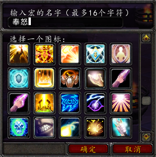
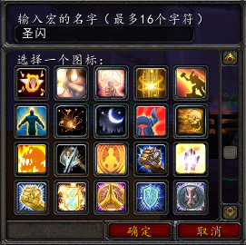
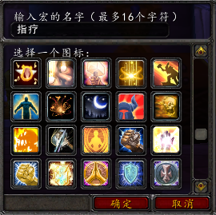
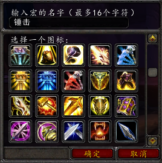
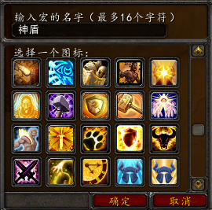

.. _圣骑士宏命令:

圣骑士宏命令
==============================================================================
:download:`下载圣骑士宏命令缓存文件 <macros-cache.txt>`, 将其放在 ``WTF/Account/<account_name>/<server_name>/<char_name>/macros-cache.txt`` 下.

奉献和神圣愤怒
------------------------------------------------------------------------------

将 ``奉献`` 和 ``神圣愤怒 (对亡灵AOE)`` 两个有CD的AOE技能绑定到一个键位上，并开始自动攻击::

    #showtooltip
    /startattack
    /cast [mod:alt] 神圣愤怒; 奉献

圣光闪现和圣光术
------------------------------------------------------------------------------

将 ``圣光闪现`` 和 ``圣光术`` 两个读条治疗技能绑定到一个键位上::

    #showtooltip
    /cast [mod:alt] 圣光术; 圣光闪现

鼠标指向治疗
------------------------------------------------------------------------------

不用选中目标, 鼠标悬停在目标上就可以对其进行治疗::

    #showtooltip
    /cast [mod:alt, target=mouseover] 圣光术; [target=mouseover] 圣光闪现

正义之锤和正义盾击
------------------------------------------------------------------------------

将防御系主要伤害技能正义之锤和有CD的嘲讽技能绑定在一起, 在没有学到正义之锤的时候可以单独将嘲讽放在这个键位上::

    #showtooltip
    /cast [mod:alt] 正义盾击; 正义之锤

神圣之盾和复仇者之盾
------------------------------------------------------------------------------

将两个有CD的需要盾牌的技能绑定在一起::

    #showtooltip
    /cast [mod:alt] 复仇者之盾; 神圣之盾

审判和清算之手
------------------------------------------------------------------------------

将审判技能和清算之手绑定在一起::

    #showtooltips
    /cast [mod:alt] 清算之手; 圣光审判

    #showtooltips
    /cast [mod:alt] 清算之手; 智慧审判

    #showtooltips
    /cast [mod:alt] 清算之手; 公正审判

神圣风暴
------------------------------------------------------------------------------

.. image:: 神圣风暴.png

施放神圣风暴时开始自动攻击::

    #showtooltip
    /startattack
    /cast 神圣风暴
