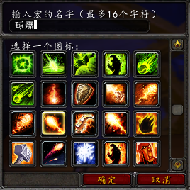
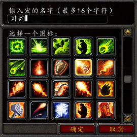
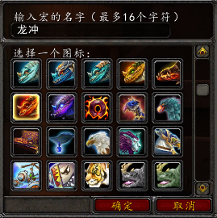
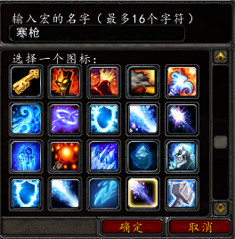
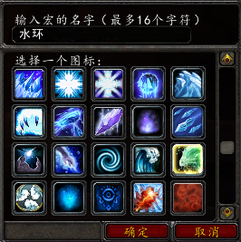
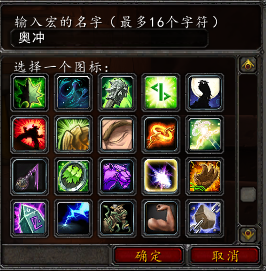

.. _法师宏命令:

法师宏命令
==============================================================================
:download:`下载法师宏命令缓存文件 <macros-cache.txt>`, 将其放在 ``WTF/Account/<account_name>/<server_name>/<char_name>/macros-cache.txt`` 下.

火球术和炎爆术
------------------------------------------------------------------------------

将 ``火球术``, 和 ``炎爆术`` 绑定到一个键位上::

    #showtooltips
    /cast [mod:alt] 炎爆术; 火球术

火焰冲击和灼烧
------------------------------------------------------------------------------

将 ``火焰冲击``, 和 ``灼烧`` 绑定到一个键位上::

    #showtooltips
    /cast [mod:alt] 灼烧; 火焰冲击

烈焰风暴和暴风雪
------------------------------------------------------------------------------

将 ``烈焰风暴``, 和 ``灼烧`` 绑定到一个键位上::

    #showtooltips
    /cast [mod:alt] 暴风雪; 烈焰风暴

龙息术和冲击波
------------------------------------------------------------------------------

将 ``龙息术``, 和 ``冲击波`` 绑定到一个键位上::

    #showtooltips
    /cast [mod:alt] 冲击波; 龙息术

冰霜新星和法力护盾
------------------------------------------------------------------------------
将 ``冰霜新星``, 和 ``法力护盾`` 绑定到一个键位上::

    #showtooltips
    /cast [mod:alt] 法力护盾; 冰霜新星

冰锥术和奥术飞弹
------------------------------------------------------------------------------
将 ``冰锥术``, 和 ``奥术飞弹`` 绑定到一个键位上::

    #showtooltips
    /cast [mod:alt] 奥术飞弹; 冰锥术

寒冰箭和冰枪术
------------------------------------------------------------------------------

将 ``寒冰箭``, 和 ``冰枪术`` 绑定到一个键位上::

    #showtooltips
    /cast [mod:alt] 冰枪术; 寒冰箭

霜火箭和冰枪术
------------------------------------------------------------------------------
将 ``霜火箭``, 和 ``冰枪术`` 绑定到一个键位上::

    #showtooltips
    /cast [mod:alt] 冰枪术; 霜火箭

水元素和冰冻术
------------------------------------------------------------------------------

无水元素时召唤水元素, 有水元素时使用冰冻术::

    #showtooltips
    /cast [target=pet,nodead,exists] 冰冻术; 召喚水元素

奥术飞弹和奥术冲击
------------------------------------------------------------------------------

将 ``奥术飞弹``, 和 ``奥术冲击`` 绑定到一个键位上::

    #showtooltips
    /cast [mod:alt] 奥术冲击; 奥术飞弹

坐骑
------------------------------------------------------------------------------

如果能飞行，则使用飞行坐骑；如果不能飞行，则使用陆地坐骑::

    #showtooltip
    /cast [flyable] 红色迅捷狮鹫; 黄色陆行鸟

单机版专用宏
------------------------------------------------------------------------------

无敌状态下暴风雪
~~~~~~~~~~~~~~~~~~~~~~~~~~~~~~~~~~~~~~~~~~~~~~~~~~~~~~~~~~~~~~~~~~~~~~~~~~~~~~

暴雪, 为自己增加一个吸收伤害, 免疫打断技能的护盾, 和一个伤害-90%的Buff, 然后释放暴风雪技能::

    #showtooltips
    /cast 暴风雪
    /cleartarget
    /target player
    .aura 33147 防打断护盾
    .aura 71781 吸收伤害盾
    .aura 68037 超强恢复术
    .aura 66482 30%减伤, 叠加3次
    .aura 66482
    .aura 66482
    /targetlasttarget

法师Buff
~~~~~~~~~~~~~~~~~~~~~~~~~~~~~~~~~~~~~~~~~~~~~~~~~~~~~~~~~~~~~~~~~~~~~~~~~~~~~~
状态, :ref:`法师有利的团队Buff <RaidBuff_SpellDPS>`

法师Debuff
~~~~~~~~~~~~~~~~~~~~~~~~~~~~~~~~~~~~~~~~~~~~~~~~~~~~~~~~~~~~~~~~~~~~~~~~~~~~~~
状态, :ref:`法师有利的团队DeBuff <RaidDeBuff_SpellDPS>`

常用物品
~~~~~~~~~~~~~~~~~~~~~~~~~~~~~~~~~~~~~~~~~~~~~~~~~~~~~~~~~~~~~~~~~~~~~~~~~~~~~~
补充, 为法师角色添加常用的药剂, 食物等物品::

    /target player
    .add 46376 -20
    .add 46376 20 冰龙
    .add 40211 -20
    .add 40211 20 速度
    .add 34767 -20
    .add 34767 20 鲑鱼
    .add 8529 -20
    .add 8529 20 诺格
    .add 6657 -20
    .add 6657 20 风蛇
    .add 40771 -20
    .add 40771 20 炸弹
    .add 17020 -20
    .add 17020 20 魔粉
    /targetlasttarget
