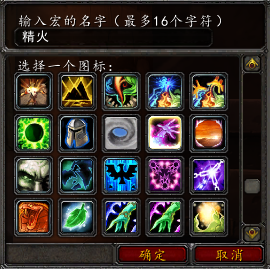
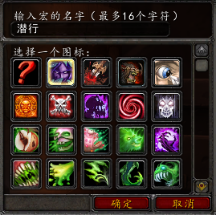
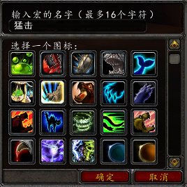
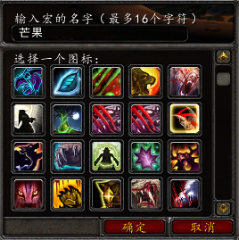
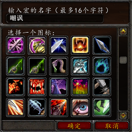
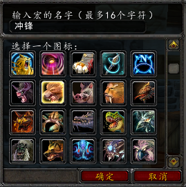
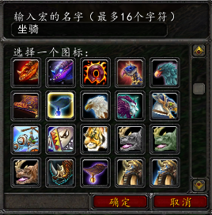
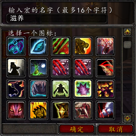
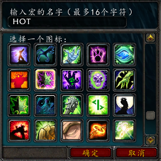
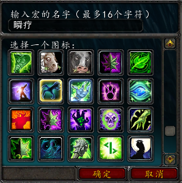

.. _德鲁伊宏命令:

德鲁伊宏命令
==============================================================================

.. contents::
    :local:

精灵之火
------------------------------------------------------------------------------

根据形态使用对应的精灵之火技能::

    #showtooltips
    /cast [nostance] 精灵之火
    /cast [stance:1] 精灵之火（野性）
    /cast [stance:3] 精灵之火（野性）
    /cast [stance:4] 精灵之火
    /cast [stance:5] 精灵之火

变猫潜行
------------------------------------------------------------------------------

如果不是猫形态则变猫，如果是猫形态则潜行::

    #showtooltips
    /cast [nostance] 猫形态
    /cast [stance:1] 猫形态
    /cast [stance:3] 潜行
    /cast [stance:4] 猫形态
    /cast [stance:5] 猫形态

变熊猛击（打断施法）
------------------------------------------------------------------------------

如果不是熊形态则变熊，如果是熊形态则猛击::

    #showtooltips
    /cast [nostance] 巨熊形态（变形）
    /cast [stance:1] 猛击
    /cast [stance:3] 巨熊形态（变形）
    /cast [stance:4] 巨熊形态（变形）
    /cast [stance:5] 巨熊形态（变形）

- 愤怒, 施放愤怒, 并上所有对法系DPS有利的Debuff::

    #showtooltip
    /cast 憤怒(等級 12)
    /stopmacro [noharm]
    .aura 54499
    .aura 47865
    .aura 22959
    .aura 33198
    .aura 31589

- 星火, 施放星火术, 并上所有对法系DPS有利的Debuff::

    #showtooltip
    /cast 星火術(等級 10)
    /stopmacro [noharm]
    .aura 54499
    .aura 47865
    .aura 22959
    .aura 33198
    .aura 31589

芒果
------------------------------------------------------------------------------

根据形态，熊形态下将芒果和割伤（主要仇恨技能），豹形态下将芒果和伏击绑定在一起, 并上所有对近战物理DPS有利的Debuff::

    #showtooltips
    /cast [mod:alt,stance:1]芒果（熊）; [stance:1]割伤
    /cast [mod:alt,stance:3]伏击; [stance:3]芒果（豹）
    /stopmacro [noharm]
    .aura 54499
    .aura 71554
    .aura 71554
    .aura 71554
    .aura 71554
    .aura 71554
    .aura 16857
    .aura 58683
    .aura 33983
    .aura 20185

嘲讽
------------------------------------------------------------------------------

施放低吼(嘲讽), 按下Alt施放挑战咆哮(群嘲)::

    #showtooltip
    /cast [mod:alt] 挑戰咆哮; 低吼

挥击
------------------------------------------------------------------------------
.. image:: 挥击.png

根据形态使用对应的挥击技能::

    #showtooltip
    /cast [stance:1] 揮擊(熊形態)(等級 8)
    /cast [stance:3] 揮擊(獵豹形態)(等級 1)

冲锋
------------------------------------------------------------------------------

根据形态使用对应的冲锋技能::

    #showtooltip
    /cast [stance:1] 野性衝鋒 - 熊形態
    /cast [stance:3] 野性衝鋒 - 獵豹形態

坐骑
------------------------------------------------------------------------------

如果能飞行，则使用飞行坐骑；如果不能飞行，则使用陆地坐骑::

    #showtooltip
    /cast [flyable] 无敌; 迅捷霜刃豹

- 状态, :ref:`熊Tank有利的团队Buff <RaidBuff_Tank>`

- 状态, :ref:`猫德有利的团队Buff <RaidBuff_PhysicDPS>`

- 状态, :ref:`平衡德有利的团队Buff <RaidBuff_SpellDPS>`

- 状态, :ref:`恢复德有利的团队Buff <RaidBuff_SpellDPS>`, 与平衡德相同。

- 补充, 为德魯伊角色添加常用的药剂, 食物等物品::

    /target player
    .add 46377 -20
    .add 46377 20
    .add 46378 -20
    .add 46378 20
    .add 46376 -20
    .add 46376 20
    .add 46379 -20
    .add 46379 20
    .add 40093 -20
    .add 40093 20
    .add 40211 -20
    .add 40211 20
    .add 33447 -20
    .add 33447 20
    .add 43268 -20
    .add 43268 20

滋养
------------------------------------------------------------------------------

无论什么时候, 按住Alt键治疗自己. 不按住Alt键时, 鼠标悬停或者选择目标时, 如果目标是右方, 则治疗友方目标. 如果是敌方, 则治疗敌方的目标::

    #showtooltips
    /cast [modifier:alt,target=player][target=mouseover,help][help][target=targettarget,help][] 滋养

HOT
------------------------------------------------------------------------------

按照序列依次上HOT::

    #showtooltips
    /castsequence 回春术, 生命绽放, 生命绽放, 生命绽放, 野性成长

瞬疗
------------------------------------------------------------------------------

瞬发迅捷治疗::

    #showtooltips
    /cast 自然迅捷
    /cast [modifier:alt,target=player][target=mouseover,help][help][target=targettarget,help][] 治疗之触
