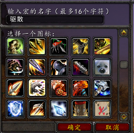

.. _牧师宏命令:

牧师宏命令
==============================================================================

.. contents::
    :local:

驱散
------------------------------------------------------------------------------

取消当前施法, 如果目标是友方, 则驱散目标; 如果目标是敌方, 则驱散目标的目标::

    #showtooltips
    /stopcasting
    /cast [help] 驱散; [target=targettarget, harm] 驱散

智能快速治疗
------------------------------------------------------------------------------
.. image:: 智能快速治疗.png

智能快速治疗; 如果鼠标悬停, 则治疗悬停目标; 如果是敌方, 则治疗目标的目标, 如果是右方, 则治疗之::

    #showtooltips
    /stopcasting
    /cast [modifier:alt,target=player][target=mouseover,help][help][target=targettarget,help][] 快速治疗

无脑输出宏
------------------------------------------------------------------------------
.. image:: 无脑输出宏.png

无脑输出宏::

    #showtooltips
    /cast [nostance] 暗影形态
    /castsequence [nochanneling] reset=target 吸血鬼之触, 心灵震爆, 精神鞭笞, 精神鞭笞, 精神鞭笞, 精神鞭笞

盾
------------------------------------------------------------------------------
.. image:: 盾.png

将 ``水之护盾`` 和 ``闪电之盾`` 两个技能绑定到一个键位上::

    #showtooltips
    /cast [mod:alt] 闪电之盾; 水之护盾
