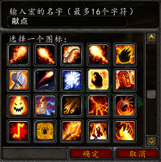
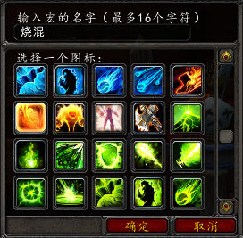
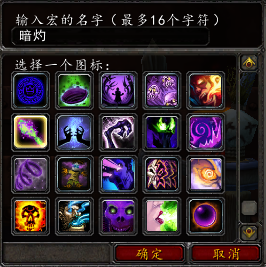
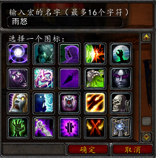

.. _术士宏命令:

术士宏命令
==============================================================================

献祭加点燃
------------------------------------------------------------------------------

将 ``献祭`` 和 ``点燃`` 两个Combo技能绑定到一个键位上::

    #showtooltips
    /cast [mod:alt] 燃烧; 献祭

烧尽和混乱之箭
------------------------------------------------------------------------------

将 ``烧尽`` 和 ``混乱之箭`` 两个读条技能绑定到一个键位上::

    #showtooltips
    /cast [mod:alt] 混乱之箭; 烧尽

暗影箭和灼热之痛
------------------------------------------------------------------------------

将 ``暗影箭`` 和 ``灼热之痛`` 两个无CD的读条技能绑定到一个键位上::

    #showtooltips
    /cast [mod:alt] 灼热之痛; 暗影箭

火焰之雨和暗影之怒
------------------------------------------------------------------------------

将 ``火焰之雨`` 和 ``暗影之怒`` 两个指定方位的AOE技能绑定到一个键位上::

    #showtooltips
    /cast [mod:alt] 暗影之怒; 火焰之雨
