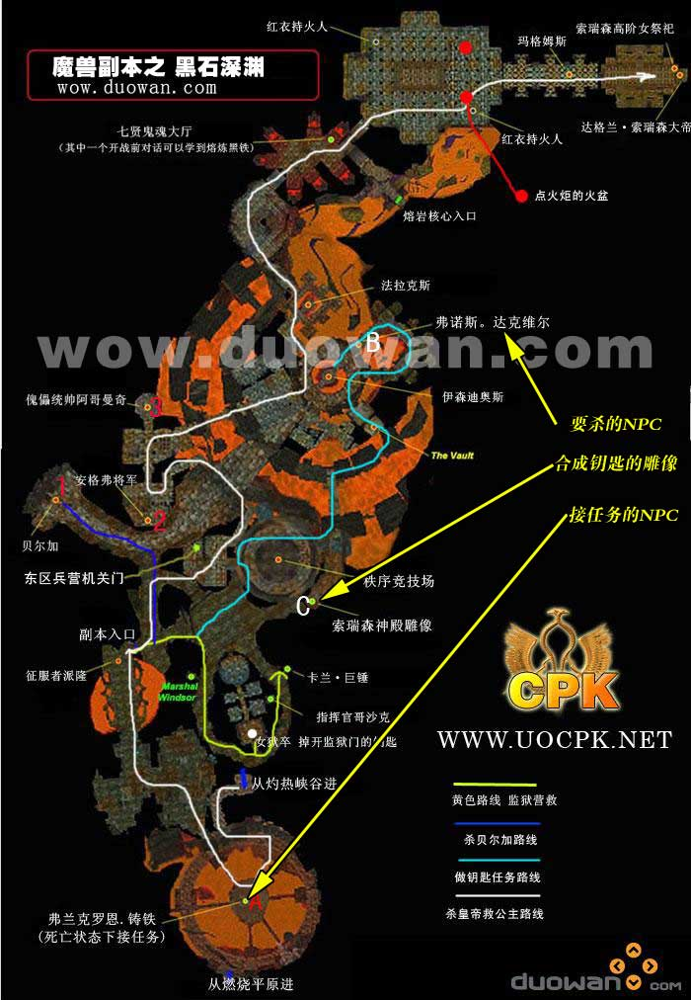
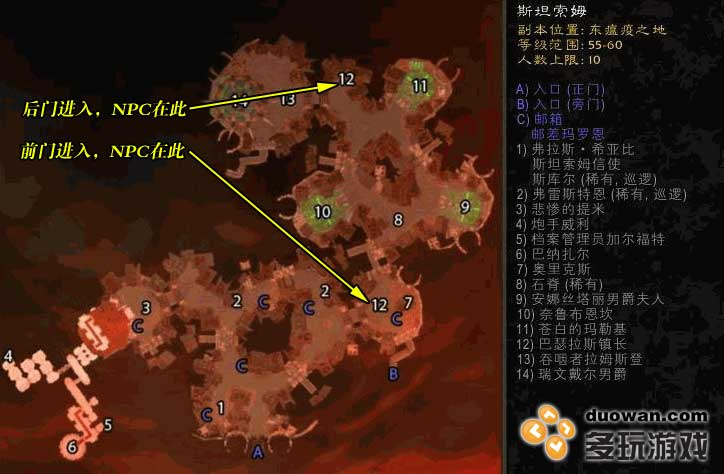
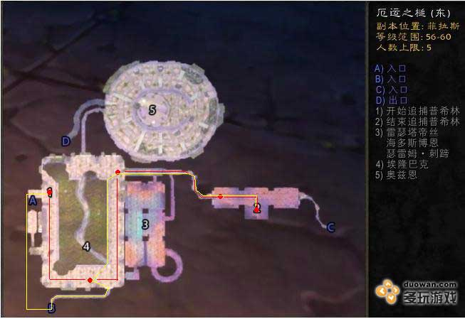
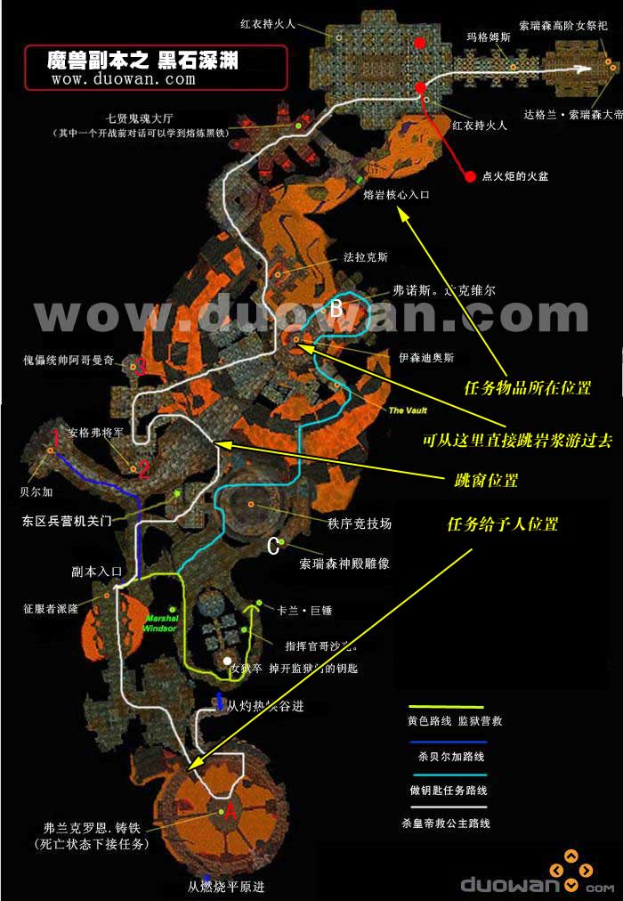
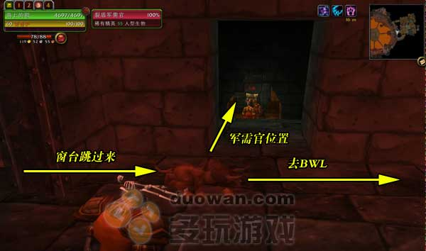

.. _key-quest:

魔兽世界里的那些钥匙任务
==============================================================================

.. contents:: 目录
    :local:

.. image:: /_static/images/other-icon/GoldenKey.png

魔兽世界中很多副本都有着 ``门`` 的设计. 需要做相关任务获得钥匙, 才能进入一些副本. 这里有一个常用的小技巧:

.. note::

    如果是位于户外的门, 则可以通过自杀, 将尸体留在门附近, 然后幽灵形态下跑进去, 在门对面复活, 就可以不用钥匙进门. 所以拥有 ``地狱烈焰`` 技能的 ``术士``, 以及拥有

    但如果是副本内, 就无法使用这个技巧了

``诺莫瑞根`` - ``车间钥匙``
------------------------------------------------------------------------------

::

    .add 6893 车间钥匙

诺莫瑞根副本有前门后门两个入口, 后门需要有 ``车间钥匙`` 才能进入.

获取方法: 从正门进入, 在 ``发射台`` 杀死Boss ``电刑器6000型`` 后获得.

``血色修道院`` - ``血色十字军钥匙``
------------------------------------------------------------------------------

::

    .add 7146 血色十字军钥匙

血色修道院副本一共4个区, 墓园, 图书馆, 军械库, 大教堂. 其中后两个区要有 ``血色十字军钥匙`` 才能进入. 在杀死图书馆区的最终 Boss 后, 可以在 Boss 房间内的箱子里找到 ``血色十字军钥匙``

``灼热峡谷`` - ``通往灼热峡谷的大门钥匙``
------------------------------------------------------------------------------

::

    .add 5396 通往灼热峡谷的大门钥匙

在 ``洛克莫丹`` 的 ``国王谷`` 的南部有一扇通往 ``灼热峡谷`` 的大门, 但需要钥匙才能打开. 联盟有一个任务可以获得这扇门的钥匙, 但部落是无法做的.

**任务流程**

.. note::

    在 ``灼热峡谷`` 的坐标 (65.6, 72.7) 处, 有一个犀牛叫 ``狂暴的玛尔戈``, 杀死后获得物品 ``玛尔戈的角``, 这个物品会触发一个任务, 让你去找 ``巡山人贝波蒂``, 在 ``洛克莫丹`` 的坐标 (18.2, 83.9) 处, 就在国王之谷锁着的门门口.

    他给你个任务去找 ``索里奥斯馆长``, 在 ``铁炉堡`` 的 ``探险者大厅``的里. 馆长会给你个任务 ``馆长的证明``, 回去找巡山人交任务, 钥匙就拿到了.

``通灵学院`` - ``骷髅钥匙``
------------------------------------------------------------------------------

::

    .add 13704 骷髅钥匙

在 ``西瘟疫之地`` 的 ``通灵学院`` 是 ``经典旧世`` 中重要的三大副本之一. 副本的入口前有一扇门, 必须有钥匙, 或是需要 ``开锁`` 技能300以上的 ``盗贼`` 才能将大门打开. 联盟和部落各有一个系列任务能最终获得这把钥匙.

**任务流程**

.. note::

    1. 获得地点

    - 联盟方: 西瘟疫之地冰风岗
    - 部落方: 西瘟疫之地亡灵壁垒

    2. 相关任务

    ``通灵学院`` -> ``骸骨碎片`` -> ``昂贵的模具`` -> ``火羽山`` -> ``阿拉基的圣甲虫``

    3. 钥匙作用:

    进入通灵学院 (如果没有钥匙, 则需要开锁300的盗贼才能将大门打开)

    4、详细流程:

    第一步: 接到任务 ``通灵学院`` (需要等级55级), 联盟方的任务给予人为冰风岗的指挥官 ``阿什拉姆·瓦罗菲斯特``, 部落方的任务给予人为亡灵壁垒的高级执行官 ``德灵顿``. 然后根据任务提示与旁边的NPC对话, 接到任务 ``骸骨碎片``

    第二步: ``骸骨碎片``. 在安多哈尔废墟杀亡灵怪, 随机掉落骸骨碎片, 需要15个. 交任务以后获得新的任务 ``昂贵的模具``

    第三步: ``昂贵的模具``. 去 ``加急森``, 找到 ``克林科·古德斯迪尔``, 合成 ``骷髅钥匙模具``, 并接受新任务 ``火羽山``.

    第四步: ``火羽山``. 带着骷髅钥匙模具和2块瑟银锭, 到环形山中间的火羽山, 山顶上有一个熔岩池. 杀掉旁边的火元素, 跳入熔岩池中, 合成 ``未完工的骷髅钥匙``, 注意: 熔岩池中会掉血, 最好找人加血, 或者迅速合成后跳出熔岩.

    第五步: 带着 ``未完工的骷髅钥匙``, 回到 ``西瘟疫之地``, 找到相关NPC交任务, 接受最后一步的任务——阿拉基的圣甲虫. 组一个小队 (团队亦可) , 到 ``安多哈尔废墟`` 中间, 杀死 ``召唤者阿拉基``, 杀死他之后, 地上有一个箱子, 打开后获得 ``阿拉基的圣甲虫``, 返回完成任务, 获得 ``骷髅钥匙``

``黑石深渊`` - ``暗炉钥匙``
------------------------------------------------------------------------------

::

    .add 11000 暗炉钥匙

黑石深渊副本可以说是魔兽世界中 **最宏伟, 最复杂的副本, 没有之一**. 暴雪原本是想将黑石深渊设计成一个完整的黑铁矮人主城. 里面有居民, 生活区, 军事区, 政治区, 贸易区, 酒吧, 宝库, 因有尽有. 进入副本后一开始左边就有一扇门, 可以快速进入副本的后半部分, 但需要``暗炉钥匙`` 或是开锁技能超过250的 ``盗贼``. 获得 ``暗炉钥匙`` 的任务非常隐蔽, 需要你在死亡后的灵魂状态下, 从黑石山的吊桥顶端走到底端的过程中找一个 NPC 接.

**任务流程**

.. note::

    1. 自杀 (找怪自杀, 或者使用 ``/stuck`` 命令自杀) , 灵魂模式跑到黑石山熔炉中间的房间里, 有一个矮人NPC弗兰 ``克罗恩·铸铁`` 的灵魂, 对话后接到任务 ``黑铁的遗产``.
    2. 复活, 进入 ``黑石深渊`` 内部, 通过 ``竞技场``, 来到 ``西区兵营``, 从窗口上跳下去, 来到 ``伊森迪奥斯`` 的大桥上, 前面就是 ``工匠大厅`` (就是有很多石头傀儡的地方) 杀死那儿的 Boss ``弗诺斯·达克维尔``, 获得任务物品 ``战锤铁胆``.
    3. 到竞技场找到 ``弗兰克罗恩·铸铁的雕像``, 放入 ``战锤铁胆``, 获得 ``暗炉钥匙``. 路线: 竞技场打完后上去 (只有打完竞技场从观众席那走, 旁边的怪才不主动打你) , 从竞技场左面的门一直走上去就到竞技场观众席那了, 走到对面的门那里, 杀到里面最右面的尽头BOSS身后就是那个交任务雕像的了.

``黑石深渊`` - ``监狱牢房钥匙``
------------------------------------------------------------------------------

::

    .add 11140 监狱牢房钥匙

经典旧世中, 联盟进入 ``奥妮克希亚的巢穴`` 副本的门钥匙任务是一个非常长的任务线, 故事非常宏大. ``拯救元帅`` 是任务的第一步. 玩家需要杀死监狱区的 Boss ``审讯官格斯塔恩`` 后获得 ``监狱牢房钥匙`` 才能打开关押 ``温德索尔元帅`` 的门.

``斯坦索姆后门`` - ``城市大门钥匙``
------------------------------------------------------------------------------

::

    .add 12382 城市大门钥匙

``城市大门钥匙`` 是进入 ``斯坦索姆`` 亡灵区的后门的钥匙. 如果没有钥匙, 则需要开锁技能超过300的 ``盗贼`` 才能打开. ``城市大门钥匙`` 由 Boss ``巴瑟拉斯镇长`` 掉落. 镇长原本就在后门的入口处, 但如果玩家从后门进入, 那么镇长会逃跑到 ``亡灵区`` 最后区域 ``屠宰场`` 附近.

``厄运之槌`` - ``月牙钥匙``
------------------------------------------------------------------------------

::

    .add 18249 月牙钥匙

厄运之槌副本按照难度从低到高分为 东, 西, 北 三个部分. 只有厄运东不需要钥匙可以直接进入, 厄运西和厄运北都需要 ``月牙钥匙`` 或是开锁技能300的 ``盗贼`` 才能进入.

厄运东也有三个入口, 分别是 ``厄运竞技场``, ``扭木庭院`` 南方, 和 ``菲拉斯`` 的 ``拉瑞斯小亭``. 只有 ``厄运竞技场``, ``扭木庭院`` 南方可以直接进入.

**任务流程**

.. note::

    从 ``厄运竞技场`` 进入副本, 会见到一个NPC ``小鬼普希林``. 与其对话以后它会迅速跑开, 跟着它的路线走 (路上的怪要杀). 它每走一段路都会停下来, 过去与其对话以后它又会继续往前跑.

    如果是一个5人小队, 跟着小鬼一边跑一边杀应该没有问题, 到达终点以后与小鬼对话, 触发战斗, 这个时候会刷出来5个小怪, 全部击杀以后 ``普希林`` 会掉落 ``月牙钥匙``.

``黑石塔上层`` - ``晋升印章``
------------------------------------------------------------------------------

::

    .add 12344 晋升印章

经典旧世中的黑石塔上层是需要有物品 ``晋升印章`` 才能开门进入的. 完成该任务需要3个拾取绑定的物品, 分别有黑石塔下层中的3个 Boss 掉落, 而且不是每次必掉. 如果不是亲友队, 出了也不一定 Roll 得到. 或是人品不好总是不掉. 以至于以前经常有组团黑石塔上层的队伍在世界频道里喊, 5G 来个开门的.

**任务流程**

.. note::

    第一步: 进入黑石塔下层, 从右边楼梯上去转右, 跳下楼台. 跳下来后一般会看到两个巡逻走来, 顺着巡逻折回的方向进左边的门 (带2头狼的怪对面), 一直贴墙向左走, 会看到一个吊桥. 不要过吊桥, 旁边有一个坡, 爬上去, 走到头时向左走(那里很黑, 容易以为没路), 会爬上一个小平台, 平台没有怪, 只有一个穴居人NPC站在那里 (远看是怪), 要走近与他对话, 接到任务 ``晋升印章``.
    
    第二步: 打宝石. 三个宝石会在指挥官沃恩, 维姆萨拉克, 欧莫克大王三个BOSS身上掉, 每个BOSS只掉一个宝石, 是绿色能ROLL的任务物品, 拾取绑定. 组队时要和队里说清楚, 不然就会容易被错投, 那就白来了. 
    
    原始晋升印章: 黑塔的任何怪都可能会掉, 0.0X% ~ 0.2% 的机率, 白色物品, 可以交易.
    
    第三步: 打齐了三个宝石以后, 回到接任务的地方把任务交了, NPC会给你只能用5次的 ``未淬火的印章`` 和 ``龙力宝石``. 并给你下一步任务 ``铸造印章``.
    
    第四步: ``铸造印章``. 龙不难找, 在 ``尘泥沼泽`` 的 ``巨龙沼泽``, ``维姆萨拉克巢穴`` <57, 88>. 在洞里就它一个怪, 是61的精英龙. 在他面前使用 ``未淬火的印章``, 然后将其打的剩下 10% 血的时候用 ``龙力宝石`` 控制他喷黑龙焰 (第一个技能) 锻造 ``未淬火的印章`` 成 ``锻造好的晋升印章``. 之后回黑石塔下层 NPC那边完成任务, 得到最后的黑石塔上层钥匙.

.. note::

    在巫妖王之怒资料片中已无需做任务即可进入.

``熔火之心`` - 传送门任务
------------------------------------------------------------------------------

::

    .add 18412 熔火碎片

熔火之心是经典旧世中的第一个团队副本, 掉落 T1 品质的装备. 该副本一共有两个入口:

1. 在黑石深渊副本中, 通过七贤宝箱事件, 下楼梯右拐, 通过一座上面有火元素的桥, 就能看到熔火之心的副本入口了.
2. 在黑石山区域的底层, 有一个血精灵 NPC (铁链下去就是), 完成他给的任务后就能从 NPC 左边的窗台跳下去, 直接传送到熔火之心.

该任务在经典旧世几乎人人必做.

**任务流程**

.. note::

    ``熔火之心的传送门``

    第一步: 接任务. 任务给予人为黑石山底层的一个高等精灵NPC ``洛索斯·天痕`` (铁链下去就是)，他会要求你去黑石深渊内部拿一块 ``熔火碎片`` 给他.
    
    第二步：进入副本. 黑石深渊内七贤大厅前面有一条分叉的路，通往熔火之心，我们需要的熔火碎片就在副本门口的左边，很大的一块石板，很好找. 如何到达这个地方呢? 当然可以用常规的方法一路杀过去. 对于60级的玩家来说，这个是很轻松的. 当然，也有捷径，不过需要消耗火抗药或者需要队伍中有治疗.
    
    **捷径**：进入副本以后左走, 打开铁门，按下图的白色路线杀过去，路上怪也不多，如果有MT在前面拉怪的话，直接冲也可以，不过不建议，因为等下要跳窗，后面有怪难免慌张，跳过头就惨了.
    
    到达下图标示的跳窗位置后，从窗口跳出去，注意别跳过头，窗外有平台，跳到平台上就好了. 等大家就位以后，一起跳到下面的路上，注意巡逻. 
    
    下去往火元素BOSS的方向前进，顺手杀了火元素BOSS（掉落各职业的火抗护腕），然后从桥上跳下，沿着左边的墙角往上走，一直走到没有地方站为止，这个时候你会看到前方岩浆中间有一个小岛，上面有几个火元素. 吃火抗药，或者让牧师上盾小德上回春，愈合，一直游过去，在小岛边缘集合（60级玩家在这里是不会引怪的.
    
    下面就很简单了, 杀了火元素, 上岸, MC大门就在眼前, 拿了任务物品以后转化为团队, 进入MC, 再出来, 就到了接任务的NPC身边了.

``黑翼之巢`` - 传送门任务
------------------------------------------------------------------------------

黑翼之巢是经典旧世中的第二个团队副本, 掉落 T2 品质的装备. 该副本一共有两个入口:

1. 在黑石塔上层, 杀死大酋长雷德后, 后面的通道里有一个副本门.
2. 在黑石塔副本的入口附近, 有一个传送宝珠, 但是需要做任务才能使用.

该任务的第一步是在黑石塔副本的入口附近, 有一个叫 ``裂盾军需官`` 的兽人怪, 杀死后会获得一个任务物品, 触发 ``黑手的命令`` 任务. 任务要求击杀 ``黑石塔上层`` 的 ``达吉萨斯将军`` Boss, 然后摸 Boss 身后的水晶球即可.

.. note::

    在巫妖王之怒资料片中已无需做任务即可进入.
