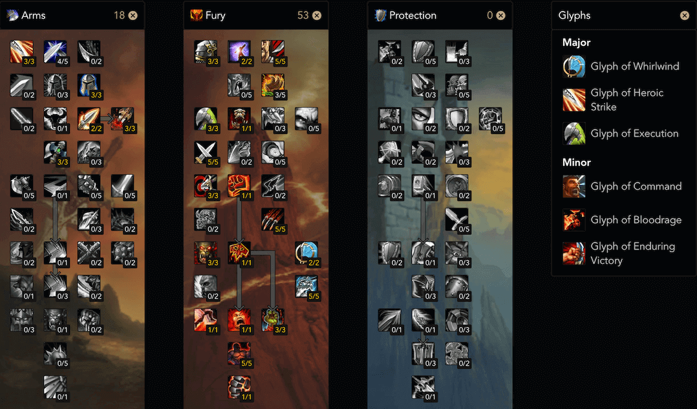

.. _build-icc-fury-warrior:

ICC 狂暴战
==============================================================================

01. Introduction 简介
------------------------------------------------------------------------------
由于怒气的机制, 装备越好伤害越高, 怒气越多, 伤害也越多, 于是不断叠加, 所有狂暴战的装备收益相比其他物理职业是最大的. 并且由于怒气不像法力, 几乎是无限的, 而且战士是近战, 运动战中 DPS 不受影响, 所以在 ICC 这种大量走位的副本中毫无疑问的成为了最顶级 DPS. 和盗贼相比, 副手命中只有 16% 的问题在 100% 怒气覆盖下几乎无限英勇, 所以副手实际命中率是 8%, 提高了大量 DPS.

优势:

- 无 CD 的 ``顺劈斩`` A 起怪来简直夸张
- ``拦截`` 技能能在各种跑位中节约时间
- 关键时刻能用宏换盾牌开 ``盾墙`` 保命

劣势:

- 无

02. Skill 技能
------------------------------------------------------------------------------
- ``嗜血``, ``旋风斩`` CD 好了就用, 怒气多就用 ``嗜血`` + ``英勇`` 宏.
- 斩杀阶段用 ``斩杀`` + ``英勇`` 宏

03. Stat 属性
------------------------------------------------------------------------------
1. 命中 8% 保证技能必中
2. 熟练 26, 保证从背后的攻击不会被 Boss 闪避
3. 破甲优先满硬破
4. 然后堆力量

04. Gear 装备
------------------------------------------------------------------------------
4 T 10 不穿手套

- 头: T10
- 肩: T10
- 胸: T10
- 护腕: 炮艇战掉落的白熊护腕, 或晶红圣所掉落的皮甲护腕
- 手套: 烂肠掉落的裂肉护手, 或腐面掉落的皮甲手套
- 腰带: 踏梦者掉落的冷魂锁链, 或教授掉落的皮甲腰带
- 裤子: 10
- 鞋子: 亡语女士掉落的邪铁战靴, 或是晶红圣所掉落的板甲鞋子
- 项链: 亡语女士掉落的项链, 献血女王掉落的项链, 或冰龙掉落的项链, 或晶红圣所掉落的板甲鞋子
- 戒指: ICC 声望戒指
- 戒指: 烂肠掉落的凋零之力, 或绿龙掉落的敏捷戒指, 或晶红圣所掉落的戒指
- 披风: 炮艇战掉落的披风
- 饰品: 萨鲁法尔掉落的意志
- 饰品: ICC 10 人英雄模式亡语女士掉落的饰品, 晶红圣所掉落的龙鳞饰品
- 武器: 影之哀伤 + 巫妖王掉落的双手剑
- 远程: 巫妖王掉落的弓

05. Gem 宝石
------------------------------------------------------------------------------
满破甲后之后

- 红: 20 力
- 黄: 10 力 10 爆
- 蓝: 10 全属性出多彩,
- 多彩: 21 敏捷 3% 爆

06. Talent Glyph 天赋 雕文
------------------------------------------------------------------------------

雕文:

- 英勇打击: 暴击回怒气, 必选
- 旋风斩: 降低 CD. 必选.
- 顺劈斩: 提高 AOE 的总伤害, 必选.

07. Macro 宏
------------------------------------------------------------------------------

08. ICC 副本攻略
------------------------------------------------------------------------------
总体来说就是: 灵活利用拦截走位, 危机时刻例如教授的软泥爆炸事用换盾牌盾墙宏保命.

1. 玛洛嘉领主

2. 亡语女士

3. 炮艇战

4. 死亡死者萨鲁法尔

5. 烂肠

6. 腐面

7. 普崔希德教授

8. 血亲王议会

9. 鲜血女王

10. 踏梦者瓦莉瑟瑞娅

11. 辛达苟萨

12. 巫妖王
