银白联赛声望与任务全面指南
==============================================================================

一. 前言
------------------------------------------------------------------------------

话说提里奥·佛丁在圣光之愿礼拜堂之战中很幸运的NINJA了把灰烬使者，并且侥幸砍伤了荔枝王阿尔萨斯，顿时意气风发，带领他的银白十字军一路穷追猛打前往诺森德挑战阿尔萨斯。

然而在诺森德与天灾的战斗中，老佛丁发现，光凭银白十字军一己之力对抗诺森德成千上万的亡灵天灾无疑是螳臂挡车，丝毫没有胜算的。于是他灵机一动，想到了联盟和部落的各位脚夫（玩家），他们可是被称为“只要掉极品装备，就算是神也杀给你看”的可怕的存在。于是乎当即在寒冰王冠的静默境界以北选一风水宝地，大兴土木，建一银白十字军联赛场地，并以极品装备为饵，邀请联盟部落各位高玩前来竞技，旨在挑选联盟部落的菁英来帮助他对抗荔枝王，同时又可以和瓦里安国王以及小地狱咆哮套近乎，真可谓一箭双雕。

我们的勇士，在老佛丁的强力诱惑下，踏上了银白联赛的征程!

二. 踏上征程
------------------------------------------------------------------------------

在达拉然的飞行平台，银白联赛特派委员尚·皮耶·普隆，免费载送玩家去银白联赛。免费的班机总是令人充满神秘感，于是乎搭乘可爱的双足飞龙（为什么不是你那漂亮的的角鹰兽啊喂！）。

欢迎来到银白联赛！！！

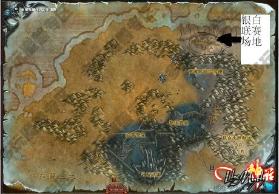

下面这幅图是各个任务的地点，银白联赛总部就是银白亭阁，部落的落脚点是夺日者亭阁。

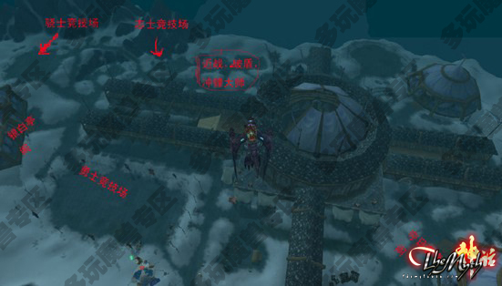

去银白亭阁接任务去，这位漂亮的御姐就是银白联赛的负责人（后台老大是佛丁0,0）。美女给我们介绍了下银白联赛，让我们去部落营地开启联赛任务。

联赛场地的最东边帐篷——夺日者亭阁找到博学者交任务，完成任务的同时居然还获得了个“银白竞逐”的成就。

三. 骑士训练
------------------------------------------------------------------------------

作为一个银白勇士，首要任务就是先去练习骑士的三个基本训练了，出口处有个部落长枪，拿上准备练习了。

主手装备上部落长枪后可以骑乘帐篷外面的坐骑了（刚开始只能骑你种族的坐骑），骑士训练的技能：

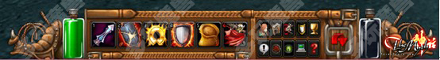

- 1号键是戳刺，一下普通的6码近战攻击造成3250伤害
- 2号键是破盾，5到30码的距离远程攻击造成2000点伤害，并且移除对手一层防御
- 3号键是冲锋，8到25码的攻击，冲锋向对手造成8500点伤害，并且移除对手1层防御， 6秒CD
- 4号键是防御，使受到的伤害降低30%，可以叠加3层，持续1分钟，有4秒的CD
- 5号键是恢复坐骑体力，可以完全恢复坐骑HP，但是只能在非战斗状态使用， 1分钟CD
- 6号键是和附近的玩家决斗（与人斗其乐无穷）

第一个训练：破盾训练

骑上我可爱的小鸟来到场地的北边找到破盾大师，按照NPC的要求对他边上的远程标靶使用3次破盾（2号键）后破到0防御再使用2次破盾，第一项训练就算完成了。

第二个训练：冲锋训练

Myth公会攻略：银白联赛任务全面指南

随后来到边上找冲锋大师，照样听下他的指点，然后对冲锋标靶先使用破盾，再冲锋，反复2次任务也算完成了～

第三个训练：近战训练

Myth公会攻略：银白联赛任务全面指南

最后去和冲锋大师边上的近战大师磕家常，给自己 **上满3层防御后** 再对近战标靶使用5次戳刺就算完成任务。

三个基本训练完成后，博学者开始真正的银白骑士日常训练，上交15枚志士印记才算真正通过了考验（好吧，算你狠！）。

从现在开始你可以接夺日者NPC给你的3个日常任务，分别是：**骑马戳刺（3项基本训练** ，**寻找宝剑**，**击杀天灾**（寒冰王冠任意杀10个天灾亡灵），3个日常提供5个志士印记，连续3天就可以晋级为骁士了。

PS：寻找宝剑是有3个任务，每天随机刷一个的，刚开始做可能有点棘手，详细介绍下：

1.灰木古剑：这个是3个中最简单的，在灰白（图示的地方）涂上NPC送你的唇膏/KISS青蛙，青蛙就有一定几率变成少女，送你灰木古剑。（别忘记抹唇膏啊！！！！）

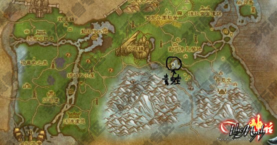

2.德克玛之刃：这个任务先要你去达拉然边上的水坝下面采4朵凛冬风信子。（愤怒之门附近）

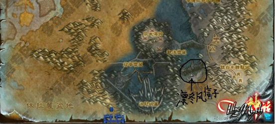

然后在德克玛湖上使用风信子就可以召唤出德克玛少女送你德克玛之刃。

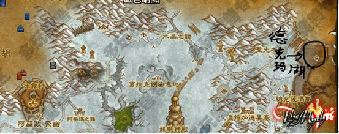

3.凛冬之锋：这个需要你在水晶之歌森林和龙骨荒野交界处（一定要有鸟飞上去哦）杀了恒燃领主（火焰亡魂的样子）拿到恒燃灰烬。

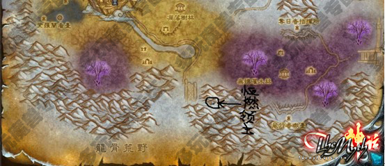

然后用恒燃灰烬去冬息湖拯救冬息湖少女，她就会送你凛冬之锋。（凛风峡湾）

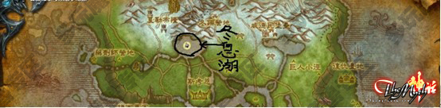

完成15个志士徽印后，博学者会让我们打败一名银白志士才能晋升为银白骁士……在联赛场地北边的志士竞技场的“侍从大卫”对话后，击败银白骁士，回去复命后会获得骁士资格。

这个时候五个部落种族都有任务给你，随便选择一个会获得代表他们参赛的资格，完成后会获得一个成就“银白奋战”。

完成任务后会开启四个日常，每天可以获得5个骁士徽印，你需要上交25个骁士徽印来取得代表银月城参赛资格。同时还会获得成就“银月城的勇士”。

四. 代表参赛
------------------------------------------------------------------------------

四个日常任务介绍：

一 寻找宝剑（见上文）：奖励2个骁士徽印。

二 在敌人的大门前：在冰冠城塞前骑战马杀死指定的小怪就OK，奖励1个骁士徽印。

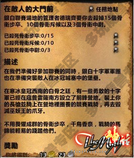

三 骁士的实地训练：任务怪就在奥多撒的下方“阵亡勇士之魂”，奖励1个骁士徽印。

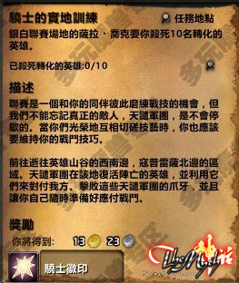

四 技术大赛：从夺日者亭阁出门左转，可以看见很多NPC。又是马战，打败3个阵营的NPC就完成任务了（每击败一个阵营的人，会获得一个DEBUFF，1小时内无法再挑战相同阵营的人），奖励1个骁士徽印。

五．黑骑士
------------------------------------------------------------------------------

在银白亭阁，十字军莱达拉发现银白联赛的黑骑士来历不明，且不停的有十字军被杀害，她希望我们去银松森林（联盟是西部荒野）调查下黑骑士的背景。

交完日记，十字军还是不知道黑骑士的阴谋，为了知道黑骑士和被害十字军之间的关联，似乎需要一种叫先知水晶的东西，于是我又被派去找先知水晶。

先知水晶在 **凋落树林** 的萨特怪身上可以打到（达拉然城下面）。

带回水晶后美女骑士要求我对3个墓地使用先知水晶来调查那些骑士死亡的真相。

“AS YOU WISH”来到 **联赛场地最东边** 的墓地群，调查的结果果然让人吃惊，一个是被毒死，一个是被烧死，还有个是被偷袭（话说这些不是埋葬时就能看的么，居然还要我辛辛苦苦去找什么先知水晶……）。把调查结果禀报后骑士们果然大为愤怒，要去黑骑士的侍从那里找出黑骑士犯罪的证据。

回到水晶森林杀个骷髅樵夫捡了它的大腿骨（囧）并用大腿骨把黑骑士的侍从敲昏（狂汗，您就不能让我捡个板砖敲么）。

一番搜身后果然找到凶手的工具组（真简单），又回去复命咯～～～

不过似乎情报并不是很满意，十字军希望把黑骑士的幕后黑手都找出来。来到墓地边上的黑骑士营地，对黑骑士的狮鹫使用缰绳，它会带你去诅咒神教在银白联赛的秘密基地，在那里找到“失窃的邀请函”和“黑骑士的命令”。回到银白亭阁后证据确凿，我们决定将黑骑士绳之以法，在勇士竞技场让“侍从丹尼”召唤黑骑士，就地正法。

五．夺日者的勇士
------------------------------------------------------------------------------

忘记说了，无论我们做银白联赛什么地方的日常，都是会增加夺日者 （联盟玩家对应的是银白联盟）声望的。当我们在夺日者声望达到崇拜时候，会获得一个成就“夺日者”。

同时系统会提示你“开启银白联赛夺日者每日任务”。在夺日者亭阁NPC会又给了3个新的日常，每个日常都会给你一个“骁士徽印”，同时，夺日者的军需官也会向你出售夺日者战袍，2种坐骑和1种宠物。

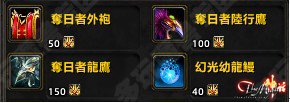

1： “库尔，又是你干的好事”，拯救4个被俘虏的银白士兵以及“鲁莽库尔”。在银白联赛场地西边的亡语者之望屠杀诅咒神教怪有几率获得黑色牢笼钥匙，用钥匙打开牢笼救出库尔和他的同伴。

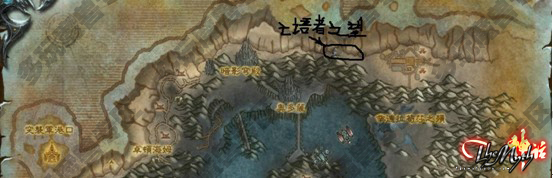

还有2个每日任务是从7个每日任务中随机刷新2个，为了避免篇幅过于冗长，我也尽量把这几个任务缩略在2张图上。

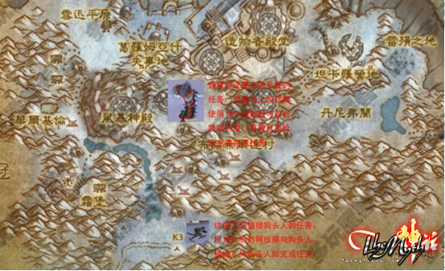

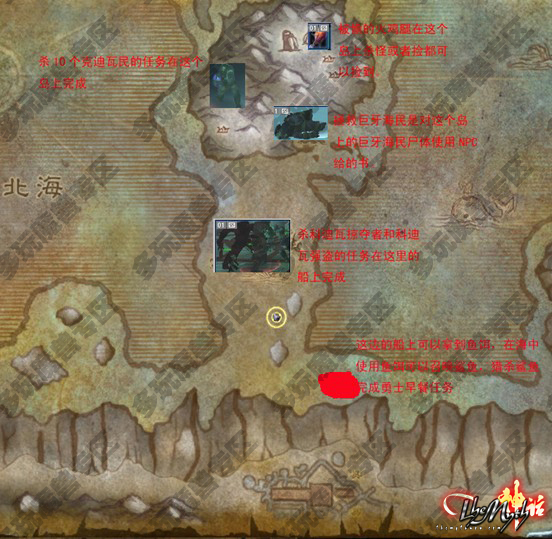

六．十字军
------------------------------------------------------------------------------

当你成为某个阵营的骁士并且在这个阵营的声望是崇拜后，你会获得一个崇拜勇士的成就，并且得到一个称号头衔，比如：我在雷霆崖声望崇拜了同时又是雷霆崖的勇士，那么我会有这个成就：

当你成为部落5个阵营的崇拜勇士并且银白十字军的声望也是崇拜以后，你获得了终极成就：十字军。

这时候银白军需官会向你出售各类传家宝，但是更重要的是下面几件：

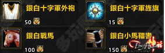

“银白十字军外袍”可以传送你到银白联赛场地（15MIN的CD，为您跑路节约好多时间）。

“银白小马缰绳”可以让您随时随地使用你的仓库（2小时CD），我是强烈建议先入手这2种，何况入手银白小马缰绳还有个成就^_^

七．结语：
------------------------------------------------------------------------------

写到这里3.2的银白十字军篇基本交代的差不多了，希望能对大家有所帮助，祝大家早日成为十字军～～～～

附：一些日常的地点：

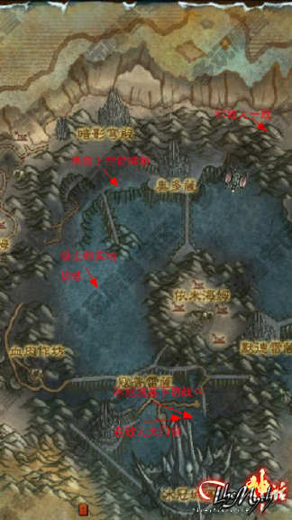

