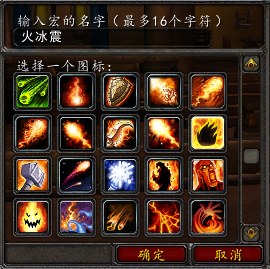
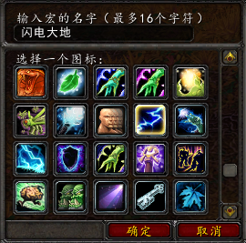
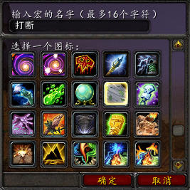
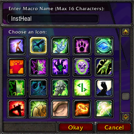
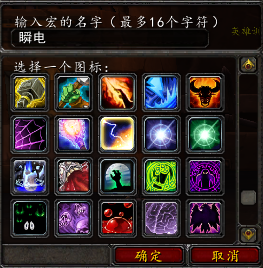
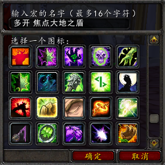
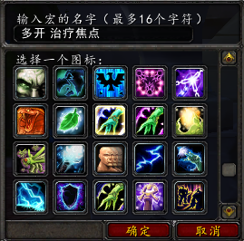
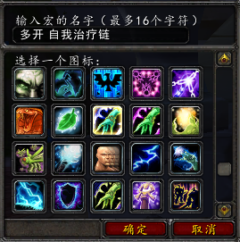
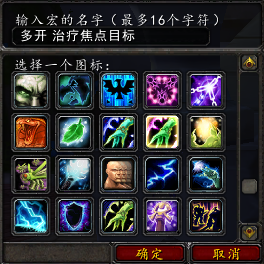

.. _萨满宏命令:

萨满宏命令
==============================================================================

.. contents::
    :local:

火焰震击和冰霜震击
------------------------------------------------------------------------------

将 ``火焰震击`` 和 ``冰霜震击`` 两个技能绑定到一个键位上::

    #showtooltips
    /cast [mod:alt] 冰霜震击; 火焰震击

闪电箭和大地震击
------------------------------------------------------------------------------

将 ``闪电箭`` 和 ``大地震击`` 两个技能绑定到一个键位上::

    #showtooltips
    /cast [mod:alt] 大地震击; 闪电箭

打断宏
------------------------------------------------------------------------------

取消当前施法, 如果目标是友方, 则打断目标的目标; 如果目标是敌方, 则打断目标施法::

    #showtooltips
    /stopcasting
    /cast [harm] 风剪; [target=targettarget, help] 风剪

驱散
------------------------------------------------------------------------------
.. image:: 驱散.png

取消当前施法, 如果目标是友方, 则驱散目标; 如果目标是敌方, 则驱散目标的目标::

    #showtooltips
    /stopcasting
    /cast [help] 净化灵魂; [target=targettarget, harm] 净化灵魂

瞬发治疗
------------------------------------------------------------------------------

开潮汐之力, 和自然迅捷, 释放必暴的治疗波; 如果鼠标悬停, 则治疗悬停目标; 如果是敌方, 则治疗目标的目标, 如果是右方, 则治疗之::

    #showtooltips
    /stopcasting
    /cast 自然迅捷
    /cast 潮汐之力
    /cast [modifier:alt,target=player][target=mouseover,help][help][target=targettarget,help][] 治疗波

瞬发闪电箭
------------------------------------------------------------------------------

瞬发闪电箭::

    #showtooltips
    /stopcasting
    /cast 元素掌握
    /cast 闪电箭

盾
------------------------------------------------------------------------------
.. image:: 盾.png

将 ``水之护盾`` 和 ``闪电之盾`` 两个技能绑定到一个键位上::

    #showtooltips
    /cast [mod:alt] 闪电之盾; 水之护盾

多开时专用
------------------------------------------------------------------------------

1号键 焦点大地之盾和激流
~~~~~~~~~~~~~~~~~~~~~~~~~~~~~~~~~~~~~~~~~~~~~~~~~~~~~~~~~~~~~~~~~~~~~~~~~~~~~~

::

    #showtooltips
    /target focus
    /cast 激流; 大地之盾

2号键 治疗焦点
~~~~~~~~~~~~~~~~~~~~~~~~~~~~~~~~~~~~~~~~~~~~~~~~~~~~~~~~~~~~~~~~~~~~~~~~~~~~~~

::

    #showtooltips
    /target focus
    /castsequence 激流, 治疗链, 次级治疗波, 治疗波

5号键 自我治疗链
~~~~~~~~~~~~~~~~~~~~~~~~~~~~~~~~~~~~~~~~~~~~~~~~~~~~~~~~~~~~~~~~~~~~~~~~~~~~~~

::

    #showtooltips
    /target player
    /cast 治疗链
    /targetlasttarget

6号键 治疗焦点目标
~~~~~~~~~~~~~~~~~~~~~~~~~~~~~~~~~~~~~~~~~~~~~~~~~~~~~~~~~~~~~~~~~~~~~~~~~~~~~~

::

    #showtooltips
    /assist focus
    /cast [modifier:alt,target=player][target=mouseover,help][help][target=targettarget,help][] 次级治疗波
