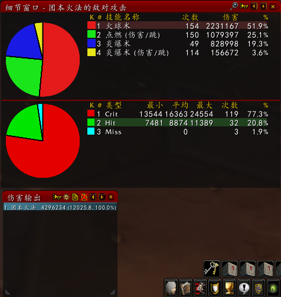

.. _巫妖王之怒火焰法师:

火焰法师
==============================================================================

火法是巫妖王之怒版本中法师的终极形态.

优势:

- 伤害极高.
- 输出循环简单, 无脑火球, 炎爆即可.
- 单体输出, 运动战, AOE战斗都很擅长.

劣势:

- 无

技能
------------------------------------------------------------------------------
主要技能:

- 火球术: 天赋强化后 3 秒施法, 法伤加成系数高.
- 炎爆术: 6 秒施法, 法伤加成系数极高. 火系天赋中的 ``法术连击`` 天赋使得高爆法师能触发免费的瞬发炎爆.
- 活体炸弹: 一个12秒的DOT, 如果持续时间到了或者被驱散了, 就会爆炸造成AOE伤害; 活体炸弹如果持续时间还没到怪物就死了, 那么不会爆炸, 所以活体炸弹适合在怪物血量较多的时候使用. 因为活体炸弹的加成系数并不高, 所以在平均装等超过245之后, 就可以将活体炸弹移除单体输出循环了.
- 冲击波: 强力的AOE法术, 并且带击退效果, 可以打断施法. PvP 向技能. 在 TOC 中的 ``阵营冠军`` Boss 中可以作为控制技能使用, 在 ICC 中的 ``死亡使者萨鲁法尔`` Boss 中可以击退血兽控场, 在 ICC 中的 ``踏梦者绿龙`` Boss 中可以击退 镇压者 小怪, 憎恶, 僵尸, 以及打断骷髅法师施法. 在 ICC 中的 ``巫妖王`` Boss 中可以击退抓人的 瓦尔其.
- 龙息术: 强力的AOE法术, 并且带迷惑效果, 可以打断施法, 以及控制目标. 在副本中主要作为打断技使用, 由于 DPS 很可能在攻击你的目标, 控制并起不到什么作用. 所以往往在 ICC, RS 副本中并不点出此技能.

手法
------------------------------------------------------------------------------
- 单目标: 无脑火球, 触发 ``法术连击`` 丢炎爆.
- 多目标: 挨个上活动炸弹.
- AOE: 活动炸弹 + 烈焰风暴 + 冲击波 + 龙息术
- 爆发输出: 开 燃魂, 开 镜像, 无脑火球, 触发 ``法术连击`` 丢炎爆.
- 运动战: 活动炸弹 + 冲击波 + 龙息术 + 火焰冲击.

属性
------------------------------------------------------------------------------
请根据你的职业, 参考以下两份说明:

- :ref:`基础属性 <巫妖王之怒基础属性说明>`
- :ref:`战斗属性 <巫妖王之怒战斗属性说明>`

智力输出:

- 命中: 所有的法系职业, **对于83级的Boss目标, 需要17%的命中才能达到命中上限**. 对于有德莱尼的团队, 此需求-1%. 对于有暗牧的团队, 此需求-3%（悲惨天赋, 使目标被法术击中的几率+3%）
- 致命: 由于 ``点燃`` 和 ``法术连击`` 天赋的存在, 致命是火法最重要的战斗属性.
- 急速: 火法不太需要堆急速.
- 精神: 在 ``熔岩护甲`` 的作用下, 精神能折算成致命等级.

致命 > 法伤 > 急速

天赋
------------------------------------------------------------------------------
- 火焰：53
- 奥术：18

.. image:: Talent.png

核心天赋:

- 法术连击: 如果连续两个火焰法术暴击, 那么可以获得一个瞬发的炎爆, 该天赋是火系最核心的天赋. 在暴击高了之后, 该天赋的成长性是指数型的.
- 火焰增效: 每当你的点燃天赋造成伤害时, 恢复你的基础法力值的2%.
- 点燃: 暴击后产生一个4秒的Dot, 该伤害可叠加, 也就是说你连续暴击之后, 前一个点燃效果会一直持续. ``点燃`` 和 ``法术连击`` 天赋决定了火焰系的成长性是指数型的.

装备
------------------------------------------------------------------------------
.. list-table::
    :widths: 10 10
    :header-rows: 1

    * - 八件主要部位
      - 武器和其余次要部位
    * - .. code-block:: python

            /target player
            .add 51281 头部
            .add 51284 肩部
            .add 51283 胸部
            .add 54582 护腕
            .add 51280 手套
            .add 50613 腰带
            .add 51282 裤子
            .add 50699 靴子

      - .. code-block:: python

            /target player
            .add 50732 主手
            .add 50719 副手
            .add 50684 远程

            .add 54583 披风
            .add 50724 项链
            .add 50714 戒指1
            .add 50398 戒指2
            .add 50365 饰品1
            .add 54588 饰品2

附魔
------------------------------------------------------------------------------
.. list-table::
    :widths: 10 60
    :header-rows: 0

    * - 命令：添加附魔物品 附魔专业制品
      - 命令：添加附魔物品 非附魔专业附魔
    * - .. code-block:: python

            /target player
            .add 43987 武器 黑魔法
            .add 44465 胸甲 10属性
            .add 44470 护腕 30法伤
            .add 38979 手套 28法伤
            .add 38986 靴子 12命中致命
            .add 39003 披风 23加速

      - .. code-block:: python

            /target player
            .add 44159 头部 祈瑞托
            .add 41602 腿部 裁缝附魔
            .add 44135 肩部 霍迪尔之子

宝石
------------------------------------------------------------------------------
.. code-block:: python

    /target player
    .add 41611 永恒腰带扣

    变换
    .add 41285 1 致命 致命伤害

    红
    .add 40152 6 法伤 致命

    黄
    .add 40124 5 致命

    蓝
    .add 40171 3 致命 精神
    .add 40172 5 命中 精神

雕文
------------------------------------------------------------------------------
.. list-table::
    :widths: 10 60
    :header-rows: 1

    * - 命令：添加雕文
      - 说明
    * - .. code-block:: python

            /target player
            大雕文
            .add 45737 活动炸弹 雕文
            .add 42739 火球 雕文
            .add 42751 熔岩护甲 雕文

            小雕文
            .add 43364 缓落 雕文
            .add 43357 防护火焰结界 雕文
            .add 43360 防护冰霜结界 雕文

      - .. code-block:: python

            说明：
            大雕文
            活动炸弹 雕文：活动炸弹的持续伤害现在可以暴击.
            火球 雕文：火球的施法时间-0.15秒, 但不再造成持续伤害效果
            熔岩护甲 雕文：熔岩护甲提高相当于你精神的20%的暴击等级

            小雕文
            缓落 雕文：你的缓落术不再需要施法材料.
            防护火焰结界 雕文：你防护火焰结界开启的情况下, 有5%的几率反射火焰法术
            防护冰霜结界 雕文：你防护火焰结界开启的情况下, 有5%的几率反射冰霜法术

常用Buff
------------------------------------------------------------------------------
:ref:`RaidBuff_SpellDPS`

常用Debuff
------------------------------------------------------------------------------
:ref:`RaidDebuff_SpellDPS`

常用消耗品
------------------------------------------------------------------------------
:ref:`WLK法系DPS消耗品`

属性图
------------------------------------------------------------------------------
.. image:: Stat.png

键位设置
------------------------------------------------------------------------------
.. image:: Key.png

DPS构成
------------------------------------------------------------------------------

