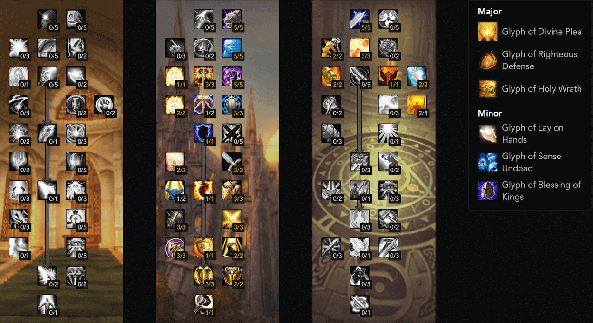

.. _build-icc-prot-paladin:

ICC 防骑
==============================================================================

01. Introduction 简介
------------------------------------------------------------------------------
在 ICC 中, 防骑的定位是副坦克. 这是因为防骑有着后期 DPS 角色都厉害了之后, 仇恨不足的问题, 不适合瞬间接怪, 容易 OT. 而防骑有着对亡灵怪优秀的控制技能, 以及 ``正义防御者`` 这一免死天赋, 能大大提高容错. 所以

优势:

- 两个生存技能: ``圣佑术``, ``神圣牺牲``, ``正义防御者`` 提供容错. ``牺牲之手`` 能给主坦克提供减伤.
- ``制裁之锤`` 和 ``神圣愤怒`` 对亡灵怪的控制, 特别是巫妖王战斗中对恐兽和瓦尔其的控制.

劣势:

- 仇恨不足, 在队员 DPS 很强力的时候不能当主坦克, 必须要 DK 来当.

02. Skill 技能
------------------------------------------------------------------------------

03. Stat 属性
------------------------------------------------------------------------------
由于王座之寒 -20% 闪避的 debuff 存在, 招架闪避这种概率的东西变得非常不靠谱了. 而 ICC 里面各种高伤害技能是无法靠招架闪避来避免的. 所以血甲流成为了最终答案.

1. 命中 8% 保证技能必中
2. 熟练无需刻意堆, 打冰龙时尽量堆到 26 减少招架的几率
3. 躲闪无需可以堆
4. 优先选择带绿字护甲的装备堆护甲
5. 血量尽量高

04. Gear 装备
------------------------------------------------------------------------------
2 T 10 即可, 4 T 10 的效果并不显著.

- 头: 亡语女士掉落的板甲头
- 肩: 炮艇战掉落的板甲肩
- 胸: T10
- 护腕: 玛洛嘉领主掉落的板甲护腕
- 手套: T10
- 腰带: 烂肠掉落的板甲腰带
- 裤子: 腐面掉落的板甲裤子
- 鞋子: 踏梦者掉落的板甲鞋子或者晶红圣所掉落的板甲鞋子
- 项链: 腐面掉落的带绿字护甲的坦克项链
- 戒指: ICC 声望戒指
- 戒指: 踏梦者掉落的带绿字护甲的坦克戒指
- 披风: 鲜血议会掉落的绿字护甲披风
- 饰品: 冰龙掉落的龙牙饰品
- 饰品: 冰霜纹章换的钥匙饰品或者晶红圣所掉落的龙鳞饰品
- 武器: 巫妖王掉落的坦克锤
- 盾牌: 鲜血女王掉落的盾牌
- 圣物: 冰霜纹章换的圣物

05. Gem 宝石
------------------------------------------------------------------------------
满命中之后, 无视奖励插 30 耐力.

- 蓝: 10 全属性出多彩,
- 多彩: 32 耐 2% 护甲

06. Talent Glyph 天赋 雕文
------------------------------------------------------------------------------

雕文:

- 神圣恩求: 3% 固定减伤, 必选.
- 正义防御: 没有这个雕文几乎不可能达到 16% 命中保证嘲讽必中. 在 ICC 里作为副坦克嘲讽不中就很有可能灭团. 必选.
- 神圣愤怒: ICC 中需要晕怪的场景很多, 以及能降低巫妖王的恐兽的威胁. 建议.
- 拯救之手: 给自己放能提供 20% 减伤, 在特定场合例如 教授, 冰龙, 萨鲁法尔 等这一类仇恨不紧张但是又要免伤的场合可以用.

07. Macro 宏
------------------------------------------------------------------------------
最重要的可能是 ``神圣牺牲`` 取消宏, 在自己扛 boss, 同时又要团队减伤的时候必备. 如果取消不及时加上 Boss 的技能可能会导致自己暴毙::

    #showtooltip
    /cast 神圣牺牲
    /cancelaura 神圣牺牲

08. ICC 副本攻略
------------------------------------------------------------------------------
1. 玛洛嘉领主

跟主坦克重叠战分担 ``军刀猛刺`` 伤害即可. 骸骨风暴冲到人群里的时候开 ``神圣牺牲`` 减伤.

2. 亡语女士

拉好小怪. 当小怪畸变成僵尸的时候用 ``制裁之锤`` 晕住跑开. 最后冲刺阶段, 用 ``复仇者之盾`` 给小怪减速风筝, 争取时间.

3. 炮艇战

主船上拉好小怪即可.

4. 死亡死者萨鲁法尔

把快追上远程的血兽嘲讽回来, 用 ``制裁之锤`` 晕住刷出来的血兽. 用 ``复仇者之盾`` 给血兽减速. 最后 Boss 狂暴阶段给主坦克 ``牺牲祝福`` 减伤, 当 Boss 打你的时候第一次开 ``圣佑术`` 减伤接 Boss, 第二次用 ``神圣牺牲`` 取消牺牲宏 + 启用冰霜牌子 换的 ``锈蚀的骷髅钥匙`` 饰品接怪.

5. 烂肠

通常当 Boss 3 层 Buff 也是主坦克叠了 8 层 Buff 的时候, 记得开 ``圣佑术`` 减伤再嘲讽接怪. 当 Boss 施放全团爆炸的时候记得开 ``神圣牺牲`` 取消牺牲宏给团队减伤, 如果忘记取消你可能会暴毙.

6. 腐面

嘲讽大软泥, 卡 5 - 8 码打审判制造仇恨, 其他时候风筝以及用 ``复仇者之盾`` 制造仇恨. 当 Boss 施放软泥爆炸的时候记得开 ``神圣牺牲`` 取消牺牲宏给团队减伤.

7. 普崔希德教授

起手接 Boss 以及拉着 Boss 走位. 两次转阶段的时候第一次绿软爆炸的时候你开 ``神圣牺牲`` 减伤. 第二次奶骑开. 最后三阶段换坦克的时候记得开 ``圣佑术`` 接手.

8. 血亲王议会

起手抗住 风王 和 火王, 保持位置动即可.

9. 鲜血女王

全程和主坦克重叠站位, 开光明圣印打血即可. 当 Boss 上天时你开 ``神圣牺牲`` 给团队减伤.

10. 踏梦者瓦莉瑟瑞娅

在憎恶死亡之前提前放好奉献, 以及留好 ``正义之锤`` 的 CD 以第一时间拉住小虫子. 腐化者可以被 ``神圣愤怒`` 晕住.

11. 辛达苟萨

最后阶段主坦克 7 层换坦消 ``秘法打击`` 的时候记得开 ``圣佑术`` 接 Boss 防止暴毙.

12. 巫妖王

恐兽狂怒时留好 ``正义之锤`` 和 ``神圣愤怒`` 的 CD, 轮流晕住. 再不济开 ``圣佑术`` 顶过去. 三阶段用晕技能晕好瓦尔其. 巫妖王第四个灵魂收割通常需要你给主坦克 ``牺牲之手`` 来减伤. 最后阶段开无敌撞鬼魂.
