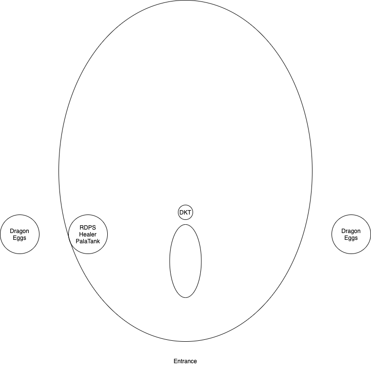
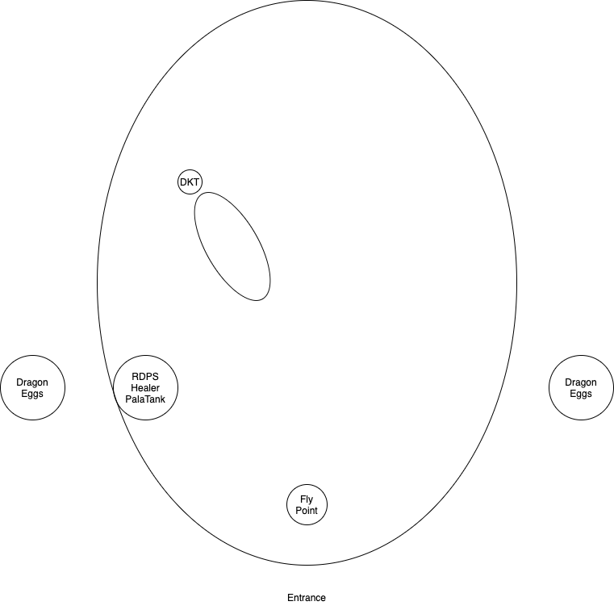

奥妮克希亚 10 人模式多开单刷
==============================================================================

Boss 血量: 4880K

- 第一阶段 地面: 100% - 65% = 1708K
- 第二阶段 空中: 65% - 40% = 1280K
- 第三阶段 地面: 40% - 0% = 1952K

团队配置:

- 2 坦克, DK 坦抗 Boss, 防骑 抗小怪
- 6 远程 DPS, 平均 DPS 6K, 6K GS 即可达到该强度.
- 2 治疗, 奶骑, 奶德

时间轴分析:

- 1 阶段: 1708 / 36 = 48 秒, 开怪每 30 秒一次龙翼打击击飞坦克.
- 2 阶段: 1280 / 36 = 35 秒, 上天后 30 秒一次深呼吸, 上天前有 10 秒阶段转换龙朝起飞点移动
- 3 阶段: 1952 / 36 = 54 秒, 下地后 30 秒一次恐惧, 下对前有 5-7 秒转阶段

灭团关键点:

- 一阶段的龙尾将团员扫到龙蛋中造成减员.
- 二阶段的深呼吸全中多开无法跑位的玩家, 对血不满 2.5w 的玩家而言必死.
- 二阶段的一个精英龙以及一群非精英小龙把团队打死.
- 三阶段的恐惧打乱阵型, 使得大龙跑去找团队一口吐息烧死团队.

战术安排:

站位示意图1:

站位示意图2:

- 开局准备:
    - 所有人焦点设为 DK, 防骑不设置任何焦点.
    - 开局前给 DK 坦克反恐结界, 以应对 3 阶段下地后的第一个恐惧.
    - 开局前给 DK 坦克道标, 奶骑固定单刷防骑坦克, 从而实现奶双坦克的效果.
    - 开局前萨满将 战栗图腾 插在防骑以及 DPS 所在的队伍, 只要防骑不被恐惧, 就不会减员. 如果防骑被恐惧, 小怪去找被 战栗图腾 唤醒的 DPS, 要比杀死治疗要好.
- 一阶段:
    - 所有人左边背靠墙壁集中站位, 图腾就原地插.
    - DK 将龙往朝着洞口的方向拉, 然后从左半边调转龙头将龙头调整为朝着正北, 如 图1. 而龙在 DPS 团队的水平线往南一点. 原因是 1 阶段坦克会吃到一次击退, 坦克向后飞之后刚好将龙拉成 图2 中的位置. 这样 DK 距离 骑士大约 45-55 码, 刚好道标能加到, 而DPS距离龙 30-36 码, 也刚好能打到. 将龙打上天后龙需要走到起飞地点起飞, 这个距离足够长且无需 DPS 走位可以一直打, 可以多出 10 秒左右的 DPS 时间.
- 二级段:
    - 龙到 70% 给 DK 坦克补一下道标.
    - 龙到 66% 血立刻开嗜血集火.
    - 非精英龙一刷, 防骑不停的原地踩奉献, 不停的使用公正之锤, 神圣之盾, 期间 DK 千万不要转火.
    - 精英龙一刷, DK 立刻跑到附近死亡凋零拉住, 并手动鼠标点击一个冰触打仇恨, 免得 DPS 不小心攻击了大龙.
    - 当起飞 30 - 45 秒后出现深呼吸提示时, 奶骑开 神圣牺牲 提供团队减伤, DK 跑到团队附近开 反魔法领域. DPS 快的话可以不出深呼吸就把龙打下来.
    - 集火 Boss 尽快将 Boss 打下来.
- 三阶段:
    - 落地后猎人开误导, 增加 DK 坦克仇恨.
    - 防骑继续踩奉献, 使用一键输出循环.
    - 落地后 1 恐惧, DK 和防骑都有反恐手段应该问题不大, DK 骨盾, 防骑使用圣佑术 减伤, 以应对治疗被恐惧断治疗这几秒.
    - 继续集火 Boss 并所有 DPS 2 分钟左右的爆发技能应该好了, 立刻开技能.
    - 全力集火 Boss 加大过量治疗, 40 多秒后 Boss 就应该死了. 如果出了第 2 恐惧, DK 坦克使用自利解除防止龙吐息团队即可.
    - 集火 Boss 直到击杀.
