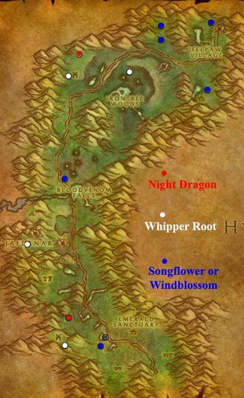

.. _任务-净化费伍德:

费伍德森林挖萝卜任务
==============================================================================

经典旧世里有一个经典任务. 之所以被称作经典任务, 是因为任务的奖励物品 ``鞭根块茎`` 和  ``夜龙之息`` 是团队副本中非常重要的补给品, 开荒团队副本时经常会需要, 所以很多打团队副本的人都做过. 这两个物品跟各种药水都不共 CD, 可以单独使用.

- ``鞭根块茎``: 恢复 700 - 900 生命
- ``夜龙之息``: 恢复 400 - 450 生命和法力

任务解析
------------------------------------------------------------------------------

起始任务: [55] 净化费伍德, NPC 坐标 <54.1, 86.8>

做完了之后, Npc会给你破灯笼,  然后你杀怪就可能会得到 ``被污染的灵魂碎片``,  每6个可以在Npc那里换两个 ``塞纳里奥膏药`` 挖矿和剥皮也有相应的物品可以换膏药. 然后到处去找被腐化的植物去净化, 一共有四种:

- ``被腐化的轻歌草``: 需要两个膏药可以净化, 净化之后可以得到一个 ``风歌夜曲`` 的Buff, 所有属性+15, 致命一击率+5%, 持续一小时.
- ``被腐化的风花果``: 需要两个膏药可以净化, 净化之后可以采到15-20个 ``风花果``, 食用之后耐力增加10点, 持续10分钟.
- ``被腐化的鞭根草``: 需要三个膏药可以净化 (``碧火小径`` 的鞭根草只需要两个就可以净化), 净化之后可以采到10-15个 ``鞭根块茎``, 使用之后回复700-900血, 有时候会双倍效果哦, 和其他药水没有公共冷却的冲突.
- ``被腐化的夜龙草``: 需要四个膏药可以净化, 净化之后可以采到5-10个 ``夜龙之息``, 使用之后回复350-460血和魔, 有时候会双倍效果, 和其他药水没有公共冷却冲突.

所有物品都是拾取绑定, 无法交易, 被净化的草当被采过之后, 25分钟之后可以再采一次, 被净化之后大概90分钟之后消失, 也就是说净化一次可以采4次哦.

- 分隔线 -

但是任务的攻略有点问题, 就是采集的时候并不是10-15个每次, 就拿 ``鞭根块茎`` 来说只有5-10个左右. 但是诀窍在于并不如攻略所说是90分钟的采药时间, 而是无限的, 采集 ``鞭根块茎``, 我做的时候大概是20-25分钟左右的随机时间, 然后每次净化之后请千万记得在25分钟左右再去一次, 如果超过了40分钟左右那个植物就会消失, 然后就是90分钟左右的CD (植物也有CD？寒一个), 所以所附带的图上的位置并不代表所有的植物分布！所以一次只需要带够净化一次的塞纳里奥药膏, 就可以无限的采集.

